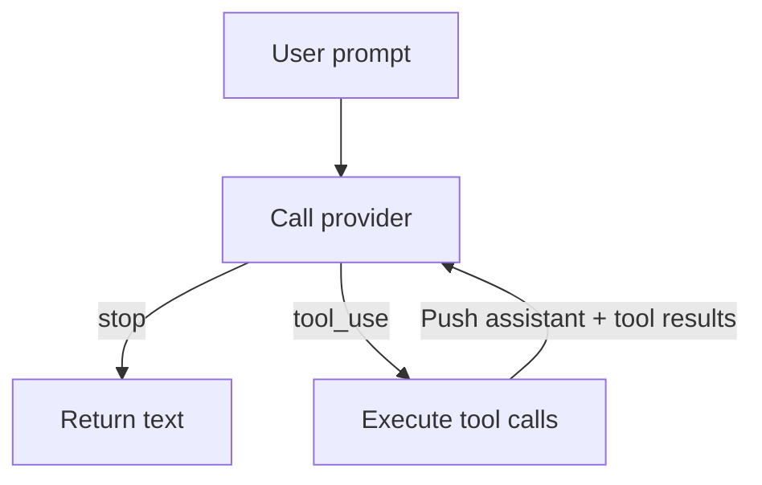

# Chương 5: SDK agent đầu tiên của bạn!

Đây là chương mà mọi thứ ghép lại với nhau. Bạn đã có một provider trả về các
phản hồi `AssistantTurn` và bốn tool thực thi hành động. Bây giờ bạn sẽ xây
dựng `SimpleAgent` -- vòng lặp nối chúng lại.

Đây là khoảnh khắc "à ha!" của cuốn sách. Agent loop ngắn đến bất ngờ, nhưng
nó chính là động cơ biến một LLM thành agent.

## Agent loop là gì?

Ở Chương 3, bạn đã xây `singleTurn()` -- một prompt, một vòng tool call, một
câu trả lời cuối. Như vậy đủ khi mô hình đã biết tất cả những gì nó cần sau
khi đọc một file. Nhưng các tác vụ thực tế thì rối hơn:

> "Tìm bug trong project này và sửa nó."

Mô hình có thể cần:

- đọc nhiều file
- chạy test
- ghi hoặc sửa code
- chạy test lại
- rồi mới báo kết quả

Mỗi bước phụ thuộc vào kết quả của bước trước đó. Đó là lý do bạn cần một
**vòng lặp**.



1. gửi messages tới provider
2. nếu mô hình đã xong, trả text
3. nếu mô hình muốn dùng tool, thực thi chúng
4. nối assistant turn và tool results vào history
5. lặp lại

Đó là toàn bộ kiến trúc của một coding agent.

Các chương sau sẽ thêm streaming, UI, planning, và subagent, nhưng core loop
vẫn không đổi.

## Mục tiêu

Hiện thực `SimpleAgent` sao cho:

1. nó giữ một provider và một tập hợp tool
2. bạn có thể đăng ký tool bằng builder pattern (`.tool(ReadTool.new())`)
3. method `run()` hiện thực vòng lặp:
   prompt -> provider -> tools -> provider -> ... -> final text

## Các khái niệm TypeScript quan trọng

### Class và interface

Starter định nghĩa:

```ts
export class SimpleAgent {
  constructor(
    readonly provider: Provider,
    tools?: ToolSet,
  ) { ... }
}
```

Đây là phiên bản TypeScript của generic `SimpleAgent<P: Provider>` trong bản
Rust. Vì TypeScript là structurally typed, field `provider` chỉ cần thỏa
interface `Provider`.

### `Map<string, Tool>` như một registry tool không đồng nhất

`ToolSet` lưu tool theo tên. Điều đó cho phép agent thực thi:

```ts
const tool = this.tools.get(call.name)
```

mà không cần một field riêng cho từng loại tool.

Đây là cùng một ý tưởng kiến trúc với `HashMap<String, Box<dyn Tool>>` trong
bản Rust. Cú pháp khác nhau, nhưng thiết kế thì giống hệt: các tool khác loại
được bọc sau một interface chung.

### Đăng ký theo kiểu builder

Method `.tool()` nên trả về `this`, cho phép:

```ts
const agent = SimpleAgent.new(provider)
  .tool(BashTool.new())
  .tool(ReadTool.new())
  .tool(WriteTool.new())
  .tool(EditTool.new())
```

Builder pattern quan trọng vì nó giữ phần cấu hình agent ngắn gọn và làm cho
đoạn khởi tạo đọc tự nhiên từ trên xuống dưới.

## Phần hiện thực

Mở `mini-claw-code-starter-ts/src/agent.ts`.

### Bước 1: Hiện thực `new()`

Constructor đã lưu provider. Factory `new()` chỉ cần tạo một `SimpleAgent`:

```ts
static new(provider: Provider): SimpleAgent {
  return new SimpleAgent(provider)
}
```

### Bước 2: Hiện thực `.tool()`

Đăng ký tool trong `ToolSet`, rồi trả về `this`:

```ts
tool(tool: Tool): SimpleAgent {
  this.tools.push(tool)
  return this
}
```

### Bước 3: Hiện thực `run()`

Đây là lõi của agent.

Cấu trúc nên là:

1. thu thập tool definitions
2. tạo history bắt đầu bằng prompt của người dùng
3. lặp vô hạn:
   - gọi `provider.chat(...)`
   - nếu `stopReason === "stop"`, trả text
   - nếu `stopReason === "tool_use"`, thực thi tool và nối kết quả

Ở dạng phác thảo:

```ts
const definitions = this.tools.definitions()
const messages: Message[] = [{ kind: "user", text: prompt }]

for (;;) {
  const turn = await this.provider.chat(messages, definitions)

  if (turn.stopReason === "stop") {
    ...
  }

  ...
}
```

### Thực thi tool

Starter đã cho bạn một helper:

```ts
protected async executeTools(
  turn: AssistantTurn,
): Promise<Array<{ id: string; content: string }>>
```

Hãy dùng nó.

Helper này mã hóa lại cùng một quy tắc từ Chương 3:

- tool không tồn tại trở thành `"error: unknown tool ..."`
- lỗi tool trở thành `"error: ..."` string

Như vậy loop chính được giữ gọn.

### Nối message

Sau khi thực thi tất cả tool call của một lượt, hãy nối assistant message rồi
đến tool-result messages:

```ts
messages.push({ kind: "assistant", turn })
for (const result of results) {
  messages.push({ kind: "tool_result", id: result.id, content: result.content })
}
```

Thứ tự quan trọng:

- assistant turn trước
- tool results sau

Điều này giữ đúng quan hệ request -> result trong history.

## Vì sao loop chính là trái tim?

Khi `SimpleAgent` hoạt động, phần còn lại của project sẽ không còn mơ hồ nữa.

Mọi thứ về sau chỉ là biến thể của pattern này:

- **streaming** thay đổi cách output từ provider đi tới
- **TUI support** thay đổi cách event được render
- **plan mode** lọc tool nào được nhìn thấy trong một pha
- **subagent** đưa cùng một loop vào trong một tool

Nhưng lõi vẫn là:

> gọi model -> kiểm tra phản hồi -> chạy tool -> nối kết quả -> lặp lại

Đó là lý do chương này là trung tâm khái niệm của cuốn sách.

## Chạy test

Chạy test của Chương 5:

```bash
bun test mini-claw-code-starter-ts/tests/ch5.test.ts
```

### Test xác minh gì?

- agent trả text của provider khi không cần tool
- loop tiếp tục cho đến khi provider cuối cùng trả `"stop"`
- đăng ký tool hoạt động qua builder pattern

## Tóm tắt

- `SimpleAgent` là thành phần biến output của model thành hành vi agent.
- Vòng lặp rất nhỏ: gọi provider, rẽ nhánh theo `stopReason`, chạy tool,
  nối kết quả, lặp lại.
- `ToolSet` cho mô hình một registry năng lực runtime.
- Khi chương này hoạt động, bạn đã có kiến trúc lõi của một coding agent.

Ở chương tiếp theo, bạn sẽ thay `MockProvider` bằng một provider HTTP thật.
