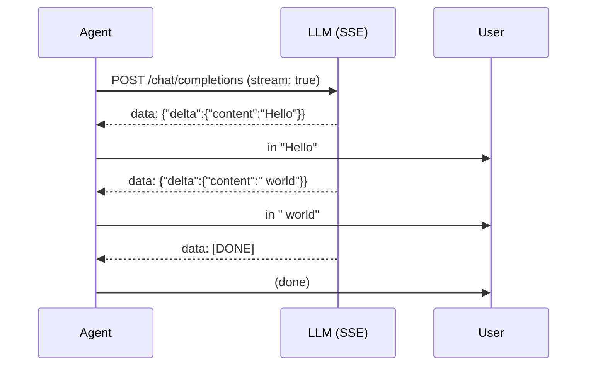

# Chương 10: Streaming

Ở Chapter 6, bạn đã xây `OpenAICompatibleProvider.chat()`, thứ chờ cho đến khi
*toàn bộ* phản hồi quay về rồi mới trả kết quả. Cách đó vẫn chạy, nhưng người
dùng sẽ nhìn thấy một màn hình trống trong lúc model đang suy nghĩ. Các coding
agent thật sự stream output ngay khi nó tới.

Chương này thêm hỗ trợ streaming và một `StreamingAgent` -- phiên bản streaming
của `SimpleAgent`. Bạn sẽ:

1. Định nghĩa một `StreamEvent` union biểu diễn các delta theo thời gian thực.
2. Xây `StreamAccumulator` để gom delta thành một `AssistantTurn` hoàn chỉnh.
3. Viết `parseSseLine()` để chuyển các dòng Server-Sent Event thô thành
   `StreamEvent`.
4. Định nghĩa interface `StreamProvider`.
5. Implement `StreamProvider` cho `OpenAICompatibleProvider`.
6. Xây `MockStreamProvider` để test mà không cần HTTP.
7. Xây `StreamingAgent<P extends StreamProvider>` -- một agent loop đầy đủ với
   text streaming theo thời gian thực.

Không có gì trong số này thay thế `Provider` hay `SimpleAgent`. Streaming chỉ là
một lớp nằm trên kiến trúc bạn đã có.

## Vì sao cần streaming?

Nếu không streaming, một câu trả lời dài làm CLI có cảm giác bị đóng băng.
Streaming giải quyết ba vấn đề:

- **Phản hồi ngay lập tức** -- người dùng nhìn thấy những từ đầu tiên sớm hơn
  thay vì chờ toàn bộ câu trả lời.
- **Hủy sớm hơn** -- nếu agent đi sai hướng, người dùng có thể dừng nó sớm.
- **Hiển thị tiến độ** -- người dùng thấy rằng agent vẫn đang làm việc.

Đó là một phần rất lớn lý do vì sao coding agent có cảm giác phản hồi tốt dù
model đang tạo một câu trả lời dài.

## SSE hoạt động thế nào?

OpenAI-compatible API stream thông qua
[Server-Sent Events (SSE)](https://developer.mozilla.org/en-US/docs/Web/API/Server-sent_events).
Bạn đặt `stream: true` trong request, và thay vì một JSON response lớn, server
sẽ gửi một chuỗi các dòng `data:`.

Ví dụ:

```text
data: {"choices":[{"delta":{"content":"Hello"},"finish_reason":null}]}

data: {"choices":[{"delta":{"content":" world"},"finish_reason":null}]}

data: {"choices":[{"delta":{},"finish_reason":"stop"}]}

data: [DONE]
```

Mỗi dòng bắt đầu bằng `data: ` rồi theo sau là JSON object hoặc sentinel
`[DONE]`. Điểm khác quan trọng so với response không streaming là mỗi chunk có
trường `delta` chỉ chứa phần mới. Code của bạn đọc từng delta, in nó ngay lập
tức, và gom nó lại thành kết quả cuối cùng.

Luồng tổng quát:



Tool call stream theo cùng cách, chỉ khác là dùng delta `tool_calls` thay vì
delta `content`. Tên tool và arguments đến theo từng mảnh, và bạn nối chúng lại.

## `StreamEvent`

Mở [`mini-claw-code-ts/src/streaming.ts`](/Users/dzung/mini-claw-code/mini-claw-code-ts/src/streaming.ts).
Union `StreamEvent` là domain type của chúng ta cho streaming delta:

```ts
export type StreamEvent =
  | { kind: "text_delta"; text: string }
  | { kind: "tool_call_start"; index: number; id: string; name: string }
  | { kind: "tool_call_delta"; index: number; arguments: string }
  | { kind: "done" };
```

Đây là interface giữa SSE parser và phần còn lại của ứng dụng. Parser tạo ra
`StreamEvent`; UI dùng nó để render; accumulator gom nó lại thành `AssistantTurn`.

## `StreamAccumulator`

Accumulator là một state machine đơn giản. Nó giữ một buffer `text` đang chạy
và danh sách các tool call đang dang dở. Mỗi lần `feed()` sẽ append vào đúng
nơi:

```ts
export class StreamAccumulator {
  feed(event: StreamEvent): void
  finish(): AssistantTurn
}
```

Implementation khá thẳng:

- `text_delta` append vào `text`
- `tool_call_start` mở rộng mảng tool call nếu cần và lưu `id` cùng `name`
  cho index đó
- `tool_call_delta` append chuỗi arguments cho index đó
- `done` không làm gì; `finish()` sẽ chuyển đổi nốt

Điểm quan trọng là arguments của tool call tới theo từng fragment. Chúng chưa
phải JSON hợp lệ cho đến khi tất cả mảnh được nối lại, nên accumulator giữ
chúng dưới dạng chuỗi cho đến cuối.

`finish()` sau đó xây `AssistantTurn` cuối cùng:

```ts
const toolCalls = partialToolCalls
  .filter((toolCall) => toolCall.name.length > 0)
  .map((toolCall) => ({
    id: toolCall.id,
    name: toolCall.name,
    arguments: JSON.parse(toolCall.arguments),
  }));

return {
  text: text.length > 0 ? text : undefined,
  toolCalls,
  stopReason: toolCalls.length > 0 ? "tool_use" : "stop",
};
```

Đó là cùng một ý tưởng như bản Rust: gom trước, chuẩn hóa sau.

## Phân tích SSE line

`parseSseLine()` nhận một dòng `data:` và trả về không hoặc nhiều event:

```ts
export function parseSseLine(line: string): StreamEvent[] | undefined
```

Parser xử lý ba trường hợp:

1. Các dòng không phải `data:` bị bỏ qua.
2. `data: [DONE]` trở thành event `done`.
3. Các dòng JSON trở thành một hoặc nhiều event text/tool-call.

Shape JSON giống OpenAI delta format:

```ts
type ChunkResponse = {
  choices: Array<{
    delta?: {
      content?: string;
      tool_calls?: Array<{
        index: number;
        id?: string;
        function?: { name?: string; arguments?: string };
      }>;
    };
  }>;
};
```

Đối với tool call, chunk đầu tiên có `id` và `function.name`, còn các chunk
sau chỉ có `function.arguments`. Parser emit `tool_call_start` khi có `id` và
`tool_call_delta` cho mỗi mảnh arguments.

## `StreamProvider`

Giống như `Provider` định nghĩa interface không streaming, `StreamProvider`
định nghĩa interface streaming:

```ts
export interface StreamProvider {
  streamChat(
    messages: Message[],
    tools: ToolDefinition[],
    onEvent: StreamEventHandler,
  ): Promise<AssistantTurn>;
}
```

Điểm khác chính so với `Provider.chat()` là callback `onEvent`. Implementation
sẽ gửi các `StreamEvent` qua callback này khi chúng xuất hiện, đồng thời vẫn
trả về `AssistantTurn` hoàn chỉnh. Như vậy caller vừa có event thời gian thực
vừa có kết quả đầy đủ.

Chúng ta giữ `StreamProvider` tách riêng khỏi `Provider` thay vì thêm method vào
interface cũ. Điều đó giữ cho các chapter không streaming đơn giản và cho phép
phần streaming được ghép thêm về sau mà không phá kiến trúc gốc.

## `OpenAICompatibleProvider`

Solution package implement `StreamProvider` cho
[`OpenAICompatibleProvider`](/Users/dzung/mini-claw-code/mini-claw-code-ts/src/providers/openai-compatible.ts).
Ý tưởng cốt lõi giống hệt method `chat()` không streaming:

1. Chuyển message nội bộ thành message API.
2. Gửi request `stream: true` bằng `fetch()`.
3. Đọc body response theo từng phần.
4. Tách theo newline.
5. Parse từng SSE line thành `StreamEvent`.
6. Feed accumulator và forward event cho caller.

Chi tiết buffer rất quan trọng. HTTP chunks không khớp với SSE lines, nên
implementation phải giữ một text buffer qua nhiều lần đọc và chỉ xử lý các
dòng hoàn chỉnh.

TypeScript version dùng cùng một OpenAI-compatible shape cho cả OpenAI và
Gemini. Các khác biệt chỉ nằm ở `baseUrl`, `apiKey`, và cấu hình `model`.

## `MockStreamProvider`

Test không nên phụ thuộc vào network. `MockStreamProvider` bọc một `Provider`
bình thường và sinh ra stream event từ `AssistantTurn` cuối cùng của nó.

Điều đó cho phép bạn kiểm tra pipeline streaming mà không cần request HTTP.

Hành vi synthetic điển hình:

- emit text từng ký tự một
- emit `tool_call_start` và `tool_call_delta` cho mỗi tool call
- emit `done` ở cuối

Như vậy test streaming vẫn deterministic nhưng vẫn chạy qua đường event thật.

## `StreamingAgent`

`StreamingAgent` là phiên bản streaming của `SimpleAgent`. Loop vẫn như cũ:
gọi provider, inspect `stopReason`, execute tools nếu cần, append messages, rồi
lặp lại.

Khác biệt là nó forward `text_delta` event tới UI ngay khi chúng tới. Điều đó có
nghĩa là terminal có thể hiển thị text trước khi toàn bộ response hoàn tất.

Cấu trúc là:

```ts
export class StreamingAgent<P extends StreamProvider> {
  constructor(provider: P, tools = new ToolSet())
  tool(tool: Tool): this
  run(prompt: string, onEvent?: AgentEventHandler): Promise<string>
  chat(messages: Message[], onEvent?: AgentEventHandler): Promise<string>
}
```

Pattern triển khai giống `SimpleAgent`, nhưng event handler được gọi trong lúc
provider vẫn đang stream.

## Dùng streaming trong TUI

TUI ở Chapter 9 trở nên dễ dùng hơn nhiều khi nó có thể tiêu thụ stream event.
Đó là thứ cho phép nó:

- in text ngay khi nó tới
- giữ spinner trong lúc chờ
- gộp output của tool call khi agent bận

Đây là lý do Chapter 10 nằm trước phần TUI nâng cao: UI cần một streaming
boundary để làm việc.

## Chạy test

Những test streaming quan trọng nhất là test parser và accumulator:

```bash
bun test mini-claw-code-ts/src/tests/streaming.test.ts
```

Những test này nên kiểm tra:

- `parseSseLine()` parse được text chunk
- `StreamAccumulator` dựng lại được `AssistantTurn`
- `MockStreamProvider` có thể điều khiển `StreamingAgent` mà không cần HTTP

## Tóm tắt

- Streaming được xếp chồng lên trên provider và agent architecture hiện có.
- SSE line phải được buffer và parse dần dần.
- `StreamAccumulator` xây lại assistant turn cuối cùng.
- `StreamingAgent` cho UI text theo thời gian thực nhưng vẫn giữ full agent loop.
- OpenAI và Gemini đều có thể nằm sau cùng một OpenAI-compatible streaming
  boundary.

Những chương tiếp theo sẽ thêm user input, plan mode, và subagents lên trên
chính runtime này.
