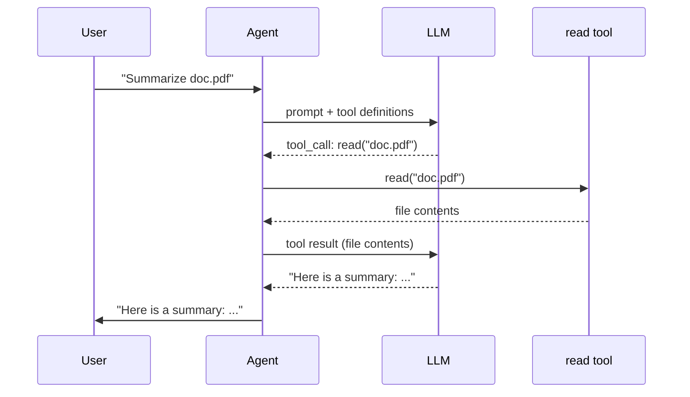
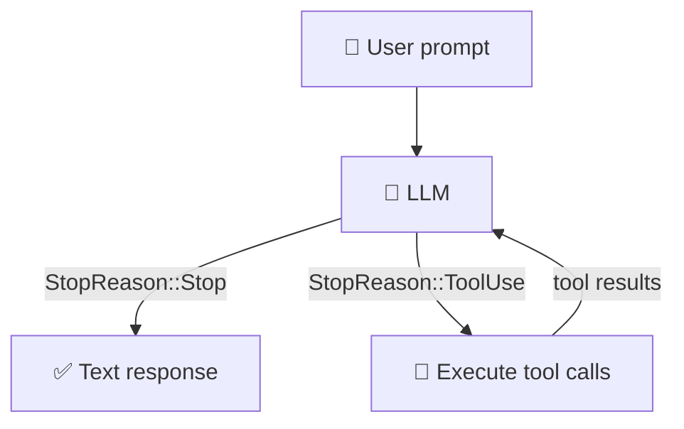

# Tổng quan

Chào mừng bạn đến với *Tự xây dựng mini coding agent bằng Rust*. Trong bảy
chương đầu tiên, bạn sẽ tự tay xây dựng một coding agent cỡ nhỏ từ đầu, một
phiên bản rút gọn của các chương trình như Claude Code hay OpenCode: một chương
trình nhận prompt, trao đổi với large language model (LLM), và dùng *tool* để
tương tác với thế giới bên ngoài. Sau đó, loạt chương mở rộng sẽ bổ sung
streaming, TUI, nhập liệu từ người dùng, plan mode, và nhiều tính năng khác.

Khi học xong cuốn sách này, bạn sẽ có một agent có thể chạy lệnh shell, đọc và
ghi file, đồng thời chỉnh sửa mã nguồn, tất cả đều được điều khiển bởi LLM. Bạn
chưa cần API key cho đến Chương 6, và khi tới đó thì model mặc định là
[`openrouter/free`](https://openrouter.ai/docs/guides/routing/routers/free-models-router),
một endpoint miễn phí trên OpenRouter, không cần credit.

## AI agent là gì?

Bản thân một LLM chỉ là một hàm: đầu vào là văn bản, đầu ra cũng là văn bản.
Nếu bạn bảo nó tóm tắt `doc.pdf`, nó hoặc sẽ từ chối, hoặc sẽ bịa ra nội dung:
nó không có cách nào để mở file đó.

Một **agent** giải quyết vấn đề này bằng cách cấp cho LLM các **tool**. Một
tool thực chất chỉ là một hàm mà code của bạn có thể chạy, chẳng hạn như đọc
file, thực thi lệnh shell, hay gọi API. Agent hoạt động trong một vòng lặp:

1. Gửi prompt của người dùng tới LLM.
2. LLM quyết định rằng nó cần đọc `doc.pdf` và xuất ra một lời gọi tool.
3. Code của bạn thực thi tool `read` và gửi nội dung file ngược lại.
4. Bây giờ LLM đã có văn bản và sẽ trả về phần tóm tắt.

LLM không bao giờ trực tiếp chạm vào filesystem. Nó chỉ *yêu cầu*, còn code của
bạn mới là thứ *thực thi*. Vòng lặp đó, yêu cầu, thực thi, gửi kết quả ngược
lại, chính là toàn bộ ý tưởng.

## LLM dùng tool như thế nào?

LLM không thể thực thi code. Nó là một bộ sinh văn bản. Vì vậy, “gọi tool”
thực chất có nghĩa là LLM *xuất ra một yêu cầu có cấu trúc*, còn code của bạn
sẽ xử lý phần còn lại.

Khi gửi request tới LLM, bạn kèm theo một danh sách **tool definition** cùng với
cuộc hội thoại. Mỗi definition bao gồm tên, mô tả, và JSON schema mô tả các
tham số. Với tool `read`, nó trông như sau:

```json
{
  "name": "read",
  "description": "Read the contents of a file.",
  "parameters": {
    "type": "object",
    "properties": {
      "path": { "type": "string" }
    },
    "required": ["path"]
  }
}
```

LLM đọc những definition này giống hệt như cách nó đọc prompt của người dùng,
chúng chỉ là một phần của input. Khi quyết định cần đọc một file, nó không chạy
bất kỳ đoạn code nào. Nó tạo ra một **structured output** như sau:

```json
{ "name": "read", "arguments": { "path": "doc.pdf" } }
```

kèm theo một tín hiệu nói rằng “tôi chưa xong, tôi vừa tạo lời gọi tool.” Code
của bạn sẽ parse nội dung này, chạy hàm thật, rồi gửi kết quả trở lại dưới dạng
một message mới. Sau đó LLM tiếp tục làm việc với kết quả đó trong ngữ cảnh.

Đây là toàn bộ chuỗi trao đổi cho ví dụ “Tóm tắt doc.pdf”:



Công việc duy nhất của LLM là quyết định *tool nào* cần gọi và *tham số nào*
cần truyền vào. Phần công việc thật sự do code của bạn thực hiện.

## Một agent tối thiểu dưới dạng giả mã

Đây là ví dụ ở trên dưới dạng code:

```text
tools    = [read_file]
messages = ["Summarize doc.pdf"]

loop:
    response = llm(messages, tools)

    if response.done:
        print(response.text)
        break

    // The LLM wants to call a tool -- run it and feed the result back.
    for call in response.tool_calls:
        result = execute(call.name, call.args)
        messages.append(result)
```

Đó là toàn bộ agent. Phần còn lại của cuốn sách chỉ là triển khai từng mảnh:
hàm `llm`, các tool, và các kiểu dữ liệu kết nối chúng lại với nhau, bằng Rust.

## Vòng lặp gọi tool

Đây là luồng xử lý của một lần agent được gọi:



1. Người dùng gửi một prompt.
2. LLM hoặc trả về văn bản hoàn chỉnh, hoặc yêu cầu một hay nhiều lời gọi tool.
3. Code của bạn thực thi từng tool và thu thập kết quả.
4. Các kết quả đó được gửi ngược lại cho LLM như những message mới.
5. Lặp lại từ bước 2 cho đến khi LLM trả về văn bản.

Đó là *toàn bộ* kiến trúc. Mọi thứ khác chỉ là chi tiết triển khai.

## Chúng ta sẽ xây gì?

Chúng ta sẽ xây dựng một framework agent đơn giản gồm:

**4 tool:**

| Tool  | Chức năng |
|-------|-----------|
| `read`  | Đọc nội dung của một file |
| `write` | Ghi nội dung vào file, tự tạo thư mục nếu cần |
| `edit`  | Thay thế chính xác một chuỗi trong file |
| `bash`  | Chạy lệnh shell và lấy output |

**1 provider:**

| Provider | Mục đích |
|----------|----------|
| `OpenRouterProvider` | Giao tiếp với LLM thật qua HTTP bằng API tương thích OpenAI |

Trong test, chúng ta sẽ dùng `MockProvider`, một provider trả về các phản hồi
được cấu hình sẵn để bạn có thể chạy toàn bộ test suite mà không cần API key.

## Cấu trúc dự án

Dự án là một Cargo workspace gồm ba crate và một cuốn tutorial book:

```text
mini-claw-code/
  Cargo.toml              # workspace root
  mini-claw-code/             # reference solution (do not peek!)
  mini-claw-code-starter/     # YOUR code -- you implement things here
  mini-claw-code-xtask/             # helper commands (cargo x ...)
  mini-claw-code-book/              # this tutorial
```

- **mini-claw-code** chứa phần cài đặt hoàn chỉnh, hoạt động đầy đủ. Nó tồn tại
  để test suite có thể xác nhận rằng bài tập là khả thi, nhưng bạn nên tránh
  đọc trước khi tự thử làm.
- **mini-claw-code-starter** là crate bạn sẽ trực tiếp làm việc. Mỗi file nguồn
  đều có định nghĩa struct, phần cài đặt trait với thân hàm `unimplemented!()`,
  và các gợi ý trong doc-comment. Nhiệm vụ của bạn là thay những chỗ
  `unimplemented!()` bằng code thật.
- **mini-claw-code-xtask** cung cấp helper `cargo x` với các lệnh `check`,
  `solution-check`, và `book`.
- **mini-claw-code-book** chính là cuốn mdBook hướng dẫn này.

## Điều kiện cần trước khi bắt đầu

Trước khi bắt đầu, hãy chắc rằng bạn có:

- **Rust** đã được cài đặt (cần 1.85+ để dùng edition 2024). Cài từ <https://rustup.rs>.
- Kiến thức Rust cơ bản: ownership, struct, enum, pattern matching, cùng với
  `Result` / `Option`. Nếu bạn đã đọc nửa đầu cuốn *The Rust Programming
  Language* thì là đủ.
- Một terminal và một trình soạn thảo văn bản.
- **mdbook** (tuỳ chọn, nếu bạn muốn đọc tutorial cục bộ). Cài bằng
  `cargo install mdbook mdbook-mermaid`.

Bạn *không* cần API key cho đến Chương 6. Từ Chương 1 đến Chương 5 đều dùng
`MockProvider` để test, nên mọi thứ đều chạy cục bộ.

## Thiết lập

Clone repository và kiểm tra xem dự án có build được không:

```bash
git clone https://github.com/dzungtri/mini-claw-code.git
cd mini-claw-code
cargo build
```

Sau đó kiểm tra test harness:

```bash
cargo test -p mini-claw-code-starter ch1
```

Các test sẽ fail, điều đó là bình thường. Nhiệm vụ của bạn trong Chương 1 là
khiến chúng pass.

Nếu `cargo x` không chạy được, hãy đảm bảo rằng bạn đang đứng ở workspace root,
tức là thư mục chứa file `Cargo.toml` cấp cao nhất.

## Lộ trình các chương

| Chương | Chủ đề | Thành quả bạn sẽ xây |
|---------|-------|----------------------|
| 1 | Kiểu dữ liệu cốt lõi | `MockProvider` -- hiểu các kiểu dữ liệu cốt lõi bằng cách xây một test helper |
| 2 | Tool đầu tiên của bạn | `ReadTool` -- đọc file |
| 3 | Một lượt xử lý | `single_turn()` -- `match` tường minh trên `StopReason`, xử lý một vòng gọi tool |
| 4 | Thêm nhiều tool | `BashTool`, `WriteTool`, `EditTool` |
| 5 | Agent SDK đầu tiên của bạn! | `SimpleAgent` -- khái quát hoá `single_turn()` thành một vòng lặp |
| 6 | OpenRouter Provider | `OpenRouterProvider` -- giao tiếp với một API LLM thật |
| 7 | Một CLI đơn giản | Nối mọi thứ lại thành một CLI tương tác có nhớ lịch sử hội thoại |
| 8 | Điểm kỳ dị | Agent của bạn giờ đã có thể tự viết code -- tiếp theo sẽ là gì? |

Chương 1 đến Chương 7 là phần thực hành: bạn viết code trong
`mini-claw-code-starter` và chạy test để kiểm tra kết quả. Chương 8 đánh dấu
điểm chuyển sang **các chương mở rộng** (9+) là nơi cuốn sách dẫn bạn đi qua
reference implementation:

| Chương | Chủ đề | Phần mở rộng được thêm vào |
|---------|-------|---------------------------|
| 9 | TUI tốt hơn | Render Markdown, spinner, và thu gọn tool call |
| 10 | Streaming | `StreamingAgent` với parser SSE và `AgentEvent` |
| 11 | Nhập liệu từ người dùng | `AskTool` -- cho phép LLM hỏi bạn các câu làm rõ |
| 12 | Chế độ lập kế hoạch | `PlanAgent` -- pha lập kế hoạch chỉ đọc với cơ chế phê duyệt |

Chương 1 đến Chương 7 đều theo cùng một nhịp:

1. Đọc chương để hiểu khái niệm.
2. Mở file nguồn tương ứng trong `mini-claw-code-starter/src/`.
3. Thay các lệnh gọi `unimplemented!()` bằng phần cài đặt của bạn.
4. Chạy `cargo test -p mini-claw-code-starter chN` để kiểm tra bài làm.

Sẵn sàng chưa? Hãy cùng xây một agent.

## Tiếp theo là gì?

Hãy chuyển sang [Chương 1: Kiểu dữ liệu cốt lõi](./ch01-core-types.md) để hiểu
các kiểu nền tảng như `StopReason`, `Message`, và trait `Provider`, đồng thời
xây `MockProvider`, test helper mà bạn sẽ dùng xuyên suốt bốn chương tiếp theo.
