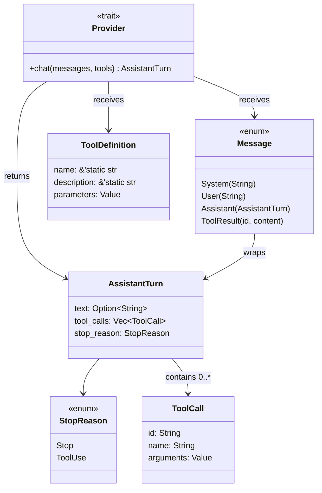
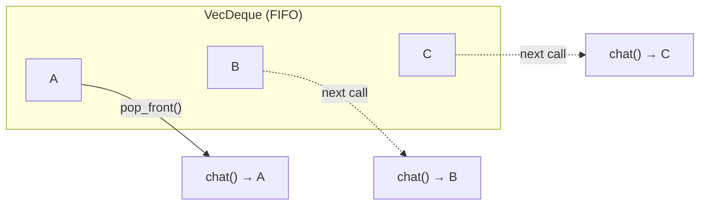

# Chương 1: Kiểu dữ liệu cốt lõi

Trong chương này, bạn sẽ hiểu các kiểu dữ liệu cấu thành giao thức của agent:
`StopReason`, `AssistantTurn`, `Message`, và trait `Provider`. Đây là những
khối nền tảng mà mọi phần còn lại đều được xây dựng trên đó.

Để kiểm tra mức độ hiểu của mình, bạn sẽ triển khai một test helper nhỏ:
`MockProvider`, một struct trả về các phản hồi được cấu hình sẵn để bạn có thể
kiểm thử các chương sau mà không cần API key.

## Mục tiêu

Hiểu các kiểu dữ liệu cốt lõi, sau đó triển khai `MockProvider` sao cho:

1. Bạn khởi tạo nó bằng một `VecDeque<AssistantTurn>` chứa các phản hồi dựng sẵn.
2. Mỗi lần gọi `chat()` sẽ trả về phản hồi kế tiếp theo đúng thứ tự.
3. Nếu đã dùng hết toàn bộ phản hồi, nó sẽ trả về lỗi.

## Các kiểu dữ liệu cốt lõi

Mở `mini-claw-code-starter/src/types.rs`. Các kiểu dữ liệu này định nghĩa giao
thức giữa agent và bất kỳ backend LLM nào.

Đây là cách chúng liên hệ với nhau:



`Provider` nhận vào messages và tool definitions, sau đó trả về một
`AssistantTurn`. Trường `stop_reason` của turn sẽ cho bạn biết bước tiếp theo
là gì.

### `ToolDefinition` và builder của nó

```rust
pub struct ToolDefinition {
    pub name: &'static str,
    pub description: &'static str,
    pub parameters: Value,
}
```

Mỗi tool sẽ khai báo một `ToolDefinition` để nói cho LLM biết nó có thể làm gì.
Trường `parameters` là một đối tượng JSON Schema mô tả các tham số của tool.

Thay vì phải tự viết JSON thủ công mỗi lần, `ToolDefinition` có sẵn builder
API:

```rust
ToolDefinition::new("read", "Read the contents of a file.")
    .param("path", "string", "The file path to read", true)
```

- `new(name, description)` tạo một definition với parameter schema rỗng.
- `param(name, type, description, required)` thêm một tham số rồi trả về
  `self`, vì vậy bạn có thể chain nhiều lần.

Bạn sẽ dùng builder này cho mọi tool bắt đầu từ Chương 2.

### `StopReason` và `AssistantTurn`

```rust
pub enum StopReason {
    Stop,
    ToolUse,
}

pub struct AssistantTurn {
    pub text: Option<String>,
    pub tool_calls: Vec<ToolCall>,
    pub stop_reason: StopReason,
}
```

Struct `ToolCall` biểu diễn một lần gọi tool:

```rust
pub struct ToolCall {
    pub id: String,
    pub name: String,
    pub arguments: Value,
}
```

Mỗi tool call có một `id` để ghép kết quả trở lại request tương ứng, một `name`
để xác định tool nào cần gọi, và `arguments` là giá trị JSON mà tool sẽ parse.

Mọi phản hồi từ LLM đều đi kèm một `stop_reason` cho biết *vì sao* model dừng
việc sinh tiếp:

- **`StopReason::Stop`**: model đã xong. Hãy kiểm tra `text` để lấy phản hồi.
- **`StopReason::ToolUse`**: model muốn gọi tool. Hãy kiểm tra `tool_calls`.

Đây là giao thức thô của LLM: model nói cho bạn biết cần làm gì tiếp theo.
Trong Chương 3, bạn sẽ viết một hàm dùng `match` trực tiếp trên `stop_reason`
để xử lý từng trường hợp. Trong Chương 5, bạn sẽ đặt phần `match` đó vào trong
một vòng lặp để tạo agent hoàn chỉnh.

### Trait `Provider`

```rust
pub trait Provider: Send + Sync {
    fn chat<'a>(
        &'a self,
        messages: &'a [Message],
        tools: &'a [&'a ToolDefinition],
    ) -> impl Future<Output = anyhow::Result<AssistantTurn>> + Send + 'a;
}
```

Điều này có nghĩa là: “Một Provider là thứ có thể nhận vào một slice message và
một slice tool definition, rồi bất đồng bộ trả về một `AssistantTurn`.”

Ràng buộc `Send + Sync` nghĩa là provider phải an toàn khi được chia sẻ giữa
nhiều thread. Điều này quan trọng vì `tokio` (async runtime) có thể di chuyển
task qua lại giữa các thread.

Lưu ý rằng `chat()` nhận `&self`, không phải `&mut self`. Provider thực tế
(`OpenRouterProvider`) không cần mutation, nó chỉ gửi HTTP request. Nếu trait
này dùng `&mut self`, mọi nơi gọi sẽ buộc phải giữ quyền truy cập độc quyền,
điều đó không cần thiết và quá hạn chế. Cái giá của lựa chọn này là:
`MockProvider` (một test helper) *thật sự* cần sửa danh sách phản hồi, nên nó
phải dùng interior mutability để tuân thủ trait.

### Enum `Message`

```rust
pub enum Message {
    System(String),
    User(String),
    Assistant(AssistantTurn),
    ToolResult { id: String, content: String },
}
```

Lịch sử hội thoại là một danh sách các giá trị `Message`:

- **`System(text)`**: system prompt dùng để thiết lập vai trò và hành vi của
  agent. Thường đây là message đầu tiên trong history.
- **`User(text)`**: prompt đến từ người dùng.
- **`Assistant(turn)`**: phản hồi từ LLM, có thể là text, tool calls, hoặc cả hai.
- **`ToolResult { id, content }`**: kết quả của việc thực thi một tool call.
  Trường `id` khớp với `ToolCall::id` để LLM biết kết quả này thuộc lần gọi nào.

Bạn sẽ bắt đầu dùng các biến thể này từ Chương 3 khi xây dựng hàm
`single_turn()`.

### Vì sao `Provider` dùng `impl Future` còn `Tool` dùng `#[async_trait]`?

Bạn có thể sẽ để ý rằng ở Chương 2, trait `Tool` dùng `#[async_trait]`, trong
khi `Provider` dùng trực tiếp `impl Future`. Khác biệt nằm ở cách trait được sử
dụng:

- **`Provider`** được dùng theo kiểu *generic* (`SimpleAgent<P: Provider>`).
  Compiler biết kiểu cụ thể ngay tại compile time, nên `impl Future` hoạt động tốt.
- **`Tool`** được lưu như một *trait object* (`Box<dyn Tool>`) trong một tập hợp
  chứa nhiều loại tool khác nhau. Trait object cần một kiểu trả về thống nhất,
  và `#[async_trait]` tạo điều đó bằng cách boxing future.

Khi cài đặt một trait dùng `impl Future`, bạn vẫn có thể viết `async fn` bình
thường trong khối `impl`, Rust sẽ tự desugar nó thành dạng `impl Future`. Nghĩa
là dù trait *định nghĩa* bằng `-> impl Future<...>`, phần *implementation* của
bạn vẫn có thể viết `async fn chat(...)`.

Nếu hiện tại điểm này còn hơi mơ hồ thì không sao, đến Chương 5, khi bạn thấy
cả hai pattern xuất hiện cùng nhau, nó sẽ rõ ràng hơn nhiều.

### `ToolSet`: tập hợp các tool

Một kiểu dữ liệu nữa bạn sẽ dùng từ Chương 3 là `ToolSet`. Nó bọc một
`HashMap<String, Box<dyn Tool>>` và đánh chỉ mục tool theo tên, nhờ đó việc tra
cứu tool để thực thi có độ phức tạp O(1). Bạn tạo nó bằng builder:

```rust
let tools = ToolSet::new()
    .with(ReadTool::new())
    .with(BashTool::new());
```

Bạn không cần tự cài đặt `ToolSet`, nó đã được cung cấp sẵn trong `types.rs`.

## Cài đặt `MockProvider`

Bây giờ, khi đã hiểu các kiểu dữ liệu, ta sẽ dùng chúng vào việc thực tế.
`MockProvider` là một test helper: nó cài đặt `Provider` bằng cách trả về các
phản hồi dựng sẵn thay vì gọi một LLM thật. Bạn sẽ dùng nó xuyên suốt Chương 2
đến Chương 5 để kiểm tra tool và agent loop mà không cần API key.

Mở `mini-claw-code-starter/src/mock.rs`. Bạn sẽ thấy struct và chữ ký hàm đã
được đặt sẵn, với phần thân hàm là `unimplemented!()`.

### Interior mutability với `Mutex`

`MockProvider` cần *lấy ra* phản hồi từ một danh sách mỗi lần `chat()` được gọi.
Nhưng `chat()` lại nhận `&self`. Vậy làm sao mutation thông qua shared
reference?

`std::sync::Mutex` của Rust cung cấp interior mutability: bạn bọc một giá trị
trong `Mutex`, và gọi `.lock().unwrap()` sẽ cho bạn một mutable guard ngay cả
khi chỉ có `&self`. Khóa này đảm bảo tại cùng một thời điểm chỉ có một thread
được truy cập dữ liệu.

```rust
use std::collections::VecDeque;
use std::sync::Mutex;

struct MyState {
    items: Mutex<VecDeque<String>>,
}

impl MyState {
    fn take_one(&self) -> Option<String> {
        self.items.lock().unwrap().pop_front()
    }
}
```

### Bước 1: Trường dữ liệu của struct

Struct đã có sẵn trường bạn cần: một `Mutex<VecDeque<AssistantTurn>>` dùng để
giữ các phản hồi. Trường này đã được cung cấp để chữ ký hàm có thể compile.
Việc của bạn là cài đặt các method sử dụng trường đó.

### Bước 2: Cài đặt `new()`

Hàm `new()` nhận vào một `VecDeque<AssistantTurn>`. Chúng ta muốn thứ tự FIFO:
mỗi lần gọi `chat()` phải trả về phản hồi *đầu tiên* còn lại, không phải phần tử
cuối cùng. `VecDeque::pop_front()` đáp ứng đúng điều đó với chi phí O(1):



Vì vậy, trong `new()`:
1. Bọc deque đầu vào bằng `Mutex`.
2. Lưu nó vào `Self`.

### Bước 3: Cài đặt `chat()`

Hàm `chat()` cần:
1. Khóa mutex.
2. Gọi `pop_front()` để lấy phản hồi tiếp theo.
3. Nếu có phản hồi, trả về `Ok(response)`.
4. Nếu deque đã rỗng, trả về lỗi.

Mock provider cố ý bỏ qua các tham số `messages` và `tools`. Nó không quan tâm
“người dùng” đã nói gì, nó chỉ đơn giản trả về phản hồi dựng sẵn tiếp theo.

Một pattern hữu ích để biến `Option` thành `Result`:

```rust
some_option.ok_or_else(|| anyhow::anyhow!("no more responses"))
```

## Chạy test

Chạy các test của Chương 1:

```bash
cargo test -p mini-claw-code-starter ch1
```

### Các test kiểm tra điều gì?

- **`test_ch1_returns_text`**: Tạo một `MockProvider` với một phản hồi có chứa
  text. Gọi `chat()` một lần và kiểm tra nội dung text khớp với mong đợi.
- **`test_ch1_returns_tool_calls`**: Tạo provider với một phản hồi chứa tool
  call. Kiểm tra tên tool call và id.
- **`test_ch1_steps_through_sequence`**: Tạo provider với ba phản hồi. Gọi
  `chat()` ba lần và kiểm tra chúng được trả về đúng thứ tự: First, Second, Third.

Đó là các test cốt lõi. Ngoài ra còn có các test cho những tình huống biên như
phản hồi rỗng, hàng đợi đã dùng hết, nhiều tool call trong cùng một turn, v.v.
Chúng sẽ pass khi phần cài đặt cốt lõi của bạn đúng.

## Tóm tắt

Bạn đã học các kiểu dữ liệu cốt lõi định nghĩa giao thức của agent:
- **`StopReason`** cho biết LLM đã xong hay muốn gọi tool.
- **`AssistantTurn`** mang phản hồi của LLM: text, tool calls, hoặc cả hai.
- **`Provider`** là trait mà mọi backend LLM đều phải cài đặt.

Bạn cũng đã xây `MockProvider`, một test helper sẽ được dùng xuyên suốt bốn
chương tiếp theo để mô phỏng hội thoại với LLM mà không cần gửi HTTP request.

## Tiếp theo là gì?

Trong [Chương 2: Tool đầu tiên của bạn](./ch02-first-tool.md), bạn sẽ cài đặt
`ReadTool`, một tool đọc nội dung file rồi trả nó lại cho LLM.
