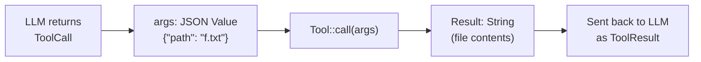

# Chương 2: Tool đầu tiên của bạn

Bây giờ bạn đã có mock provider, đã đến lúc xây tool đầu tiên. Bạn sẽ cài đặt
`ReadTool`, một tool đọc file và trả về nội dung của nó. Đây là tool đơn giản
nhất trong agent của chúng ta, nhưng nó giới thiệu pattern `Tool` trait mà mọi
tool khác đều tuân theo.

## Mục tiêu

Cài đặt `ReadTool` sao cho:

1. Nó khai báo tên, mô tả, và parameter schema của mình.
2. Khi được gọi với đối số `{"path": "some/file.txt"}`, nó đọc file và trả về
   nội dung dưới dạng chuỗi.
3. Thiếu tham số hoặc file không tồn tại phải sinh lỗi.

## Các khái niệm Rust quan trọng

### Trait `Tool`

Mở `mini-claw-code-starter/src/types.rs` và xem trait `Tool`:

```rust
#[async_trait::async_trait]
pub trait Tool: Send + Sync {
    fn definition(&self) -> &ToolDefinition;
    async fn call(&self, args: Value) -> anyhow::Result<String>;
}
```

Có hai method:

- **`definition()`** trả về metadata của tool: tên, mô tả, và JSON schema mô tả
  tham số. LLM dùng thông tin này để quyết định nên gọi tool nào và định dạng
  đối số ra sao.
- **`call()`** thực thi tool thật sự. Nó nhận một `serde_json::Value` chứa đối
  số và trả về kết quả dạng chuỗi.

### `ToolDefinition`

```rust
pub struct ToolDefinition {
    pub name: &'static str,
    pub description: &'static str,
    pub parameters: Value,
}
```

Như bạn đã thấy ở Chương 1, `ToolDefinition` có builder API để khai báo tham số.
Với `ReadTool`, chúng ta cần một tham số bắt buộc duy nhất là `"path"` có kiểu
`"string"`:

```rust
ToolDefinition::new("read", "Read the contents of a file.")
    .param("path", "string", "The file path to read", true)
```

Ở bên dưới, builder này sẽ tạo ra JSON Schema mà bạn đã thấy ở Chương 1.
Đối số cuối cùng (`true`) đánh dấu tham số là bắt buộc.

### Vì sao dùng `#[async_trait]` thay vì `async fn` thuần?

Bạn có thể thắc mắc tại sao ta dùng macro `async_trait` thay vì viết `async fn`
trực tiếp trong trait. Lý do là **khả năng tương thích với trait object**.

Về sau, trong agent loop, chúng ta sẽ lưu các tool trong một `ToolSet`, một tập
hợp dựa trên HashMap chứa nhiều loại tool khác nhau nhưng cùng chia sẻ một giao
diện chung. Điều này đòi hỏi *dynamic dispatch*, nghĩa là compiler phải biết
kích thước của kiểu trả về tại compile time.

`async fn` trong trait sẽ sinh ra một kiểu `Future` khác nhau cho từng phần cài
đặt. Điều đó làm dynamic dispatch không hoạt động. Macro `#[async_trait]` tự
động chuyển `async fn` thành method trả về `Pin<Box<dyn Future<...>>>`, vốn có
kích thước cố định và đã biết trước, bất kể tool nào tạo ra nó. Bạn vẫn viết
`async fn` bình thường, còn macro sẽ xử lý việc boxing.

Đây là luồng dữ liệu khi agent gọi một tool:



LLM không bao giờ chạm vào filesystem. Nó tạo ra một JSON request, code của bạn
thực thi request đó, rồi trả lại kết quả dưới dạng chuỗi.

## Phần cài đặt

Mở `mini-claw-code-starter/src/tools/read.rs`. Struct, `Default` impl, và chữ
ký method đã được cung cấp sẵn.

Hãy nhớ thêm `#[async_trait::async_trait]` vào khối `impl Tool for ReadTool`.
File starter đã có sẵn annotation này rồi.

### Bước 1: Cài đặt `new()`

Tạo một `ToolDefinition` rồi lưu nó vào `self.definition`. Hãy dùng builder:

```rust
ToolDefinition::new("read", "Read the contents of a file.")
    .param("path", "string", "The file path to read", true)
```

### Bước 2: `definition()` - đã có sẵn

Method `definition()` đã được cài đặt trong starter, nó chỉ đơn giản trả về
`&self.definition`. Bạn không cần làm gì thêm ở đây.

### Bước 3: Cài đặt `call()`

Đây là nơi diễn ra phần công việc thật sự. Phần cài đặt của bạn cần:

1. Lấy đối số `"path"` từ `args`.
2. Đọc file bất đồng bộ.
3. Trả về nội dung file.

Khung tổng thể sẽ như sau:

```rust
async fn call(&self, args: Value) -> anyhow::Result<String> {
    // 1. Extract path
    // 2. Read file with tokio::fs::read_to_string
    // 3. Return contents
}
```

Một số API hữu ích:

- `args["path"].as_str()` trả về `Option<&str>`. Hãy dùng
  `.context("missing 'path' argument")?` từ `anyhow` để biến `None` thành lỗi rõ ràng.
- `tokio::fs::read_to_string(path).await` đọc file bất đồng bộ. Hãy nối tiếp với
  `.with_context(|| format!("failed to read '{path}'"))?` để có thông báo lỗi rõ ràng.

Vậy thôi: lấy path, đọc file, trả về nội dung.

## Chạy test

Chạy các test của Chương 2:

```bash
cargo test -p mini-claw-code-starter ch2
```

### Các test kiểm tra điều gì?

- **`test_ch2_read_definition`**: Tạo một `ReadTool` rồi kiểm tra tên của nó là
  `"read"`, description không rỗng, và `"path"` nằm trong danh sách tham số bắt buộc.
- **`test_ch2_read_file`**: Tạo một file tạm với nội dung đã biết, gọi
  `ReadTool` bằng đường dẫn tới file đó, rồi kiểm tra nội dung trả về có khớp không.
- **`test_ch2_read_missing_file`**: Gọi `ReadTool` với một path không tồn tại và
  kiểm tra rằng nó trả về lỗi.
- **`test_ch2_read_missing_arg`**: Gọi `ReadTool` với một JSON object rỗng
  (không có key `"path"`) và kiểm tra rằng nó trả về lỗi.

Ngoài ra còn có nhiều test tình huống biên như file rỗng, nội dung unicode,
sai kiểu tham số, v.v. Những test đó sẽ pass khi phần cài đặt cốt lõi của bạn
đúng.

## Tóm tắt

Bạn đã xây tool đầu tiên bằng cách cài đặt trait `Tool`. Những pattern quan trọng:

- **`ToolDefinition::new(...).param(...)`** dùng để khai báo tên, mô tả, và
  tham số của tool.
- **`#[async_trait::async_trait]`** trên khối `impl` cho phép bạn viết
  `async fn call()` mà vẫn tương thích với trait object.
- **`tokio::fs`** được dùng cho thao tác file I/O bất đồng bộ.
- **`anyhow::Context`** giúp bổ sung thông báo lỗi rõ ràng hơn.

Mọi tool trong agent đều đi theo đúng cấu trúc này. Khi bạn đã hiểu `ReadTool`,
các tool còn lại chỉ là những biến thể khác nhau của cùng một pattern.

## Tiếp theo là gì?

Trong [Chương 3: Một lượt xử lý](./ch03-single-turn.md), bạn sẽ viết một hàm
dùng `match` trên `StopReason` để xử lý một vòng gọi tool duy nhất.
