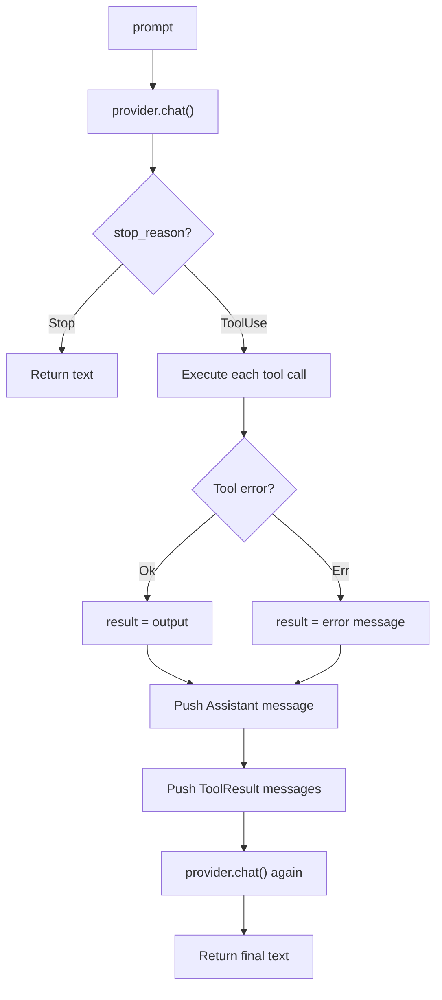
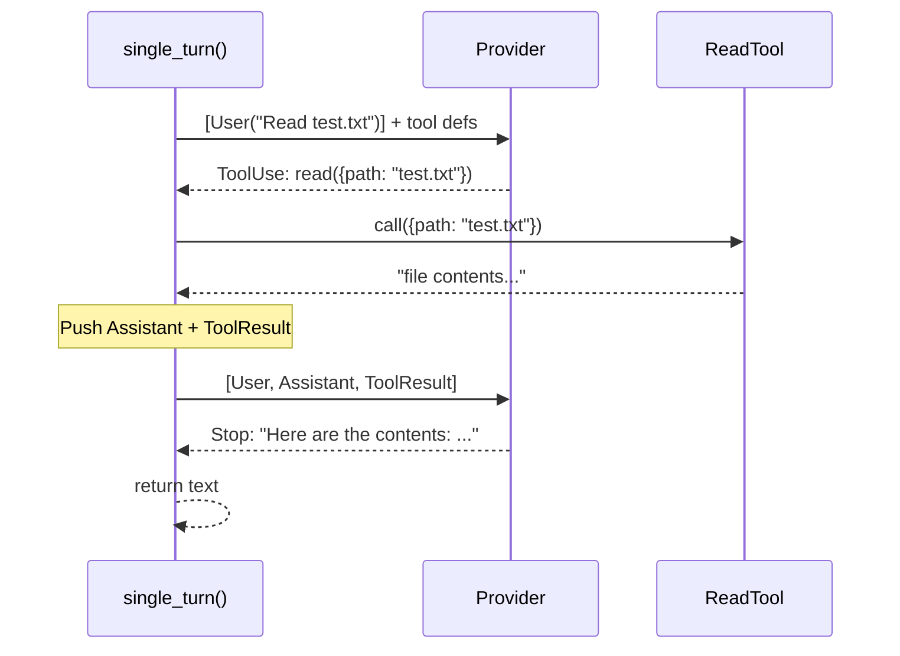
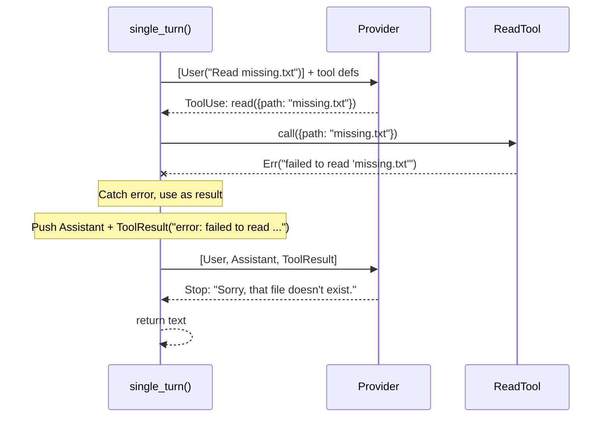

# Chương 3: Một lượt xử lý

Bạn đã có provider và một tool. Trước khi nhảy vào agent loop hoàn chỉnh, hãy
xem giao thức thô hoạt động ra sao: LLM trả về một `stop_reason` để cho biết nó
đã xong hay còn muốn dùng tool. Trong chương này, bạn sẽ viết một hàm xử lý
chính xác một prompt với tối đa một vòng gọi tool.

## Mục tiêu

Cài đặt `single_turn()` sao cho:

1. Nó gửi một prompt tới provider.
2. Nó dùng `match` trên `stop_reason`.
3. Nếu là `Stop` thì trả về text.
4. Nếu là `ToolUse` thì thực thi các tool, gửi kết quả ngược lại, rồi trả về text cuối cùng.

Không có vòng lặp. Chỉ một lượt xử lý.

## Các khái niệm Rust quan trọng

### `ToolSet`: một HashMap chứa các tool

Chữ ký hàm nhận `&ToolSet` thay vì một slice hay vector thô:

```rust
pub async fn single_turn<P: Provider>(
    provider: &P,
    tools: &ToolSet,
    prompt: &str,
) -> anyhow::Result<String>
```

`ToolSet` bọc một `HashMap<String, Box<dyn Tool>>` và đánh chỉ mục tool theo tên
trong definition. Điều này giúp việc tra cứu khi thực thi tool call có độ phức
tạp O(1), thay vì phải quét qua toàn bộ danh sách. Builder API sẽ tự lấy tên
từ definition của từng tool:

```rust
let tools = ToolSet::new().with(ReadTool::new());
let result = single_turn(&provider, &tools, "Read test.txt").await?;
```

### Dùng `match` với `StopReason`

Đây là điểm trọng tâm của chương. Thay vì kiểm tra `tool_calls.is_empty()`, bạn
phải `match` trực tiếp trên stop reason:

```rust
match turn.stop_reason {
    StopReason::Stop => { /* return text */ }
    StopReason::ToolUse => { /* execute tools */ }
}
```

Điều này làm giao thức hiện ra rõ ràng. LLM đang nói cho bạn biết cần làm gì,
và bạn xử lý từng trường hợp một cách tường minh.

Đây là luồng đầy đủ của `single_turn()`:



Khác biệt chính so với agent loop hoàn chỉnh ở Chương 5 là ở đây không có vòng
lặp ngoài. Nếu LLM lại tiếp tục yêu cầu dùng tool lần thứ hai, `single_turn()`
sẽ không xử lý được, đó là việc của agent loop.

## Phần cài đặt

Mở `mini-claw-code-starter/src/agent.rs`. Bạn sẽ thấy chữ ký hàm
`single_turn()` nằm ở đầu file, phía trên struct `SimpleAgent`.

### Bước 1: Thu thập tool definitions

`ToolSet` có method `definitions()` để trả về toàn bộ tool schema:

```rust
let defs = tools.definitions();
```

### Bước 2: Tạo message ban đầu

```rust
let mut messages = vec![Message::User(prompt.to_string())];
```

### Bước 3: Gọi provider

```rust
let turn = provider.chat(&messages, &defs).await?;
```

### Bước 4: `match` trên `stop_reason`

Đây là phần cốt lõi của hàm:

```rust
match turn.stop_reason {
    StopReason::Stop => Ok(turn.text.unwrap_or_default()),
    StopReason::ToolUse => {
        // execute tools, send results, get final answer
    }
}
```

Với nhánh `ToolUse`:

1. Với mỗi tool call, tìm tool tương ứng và gọi nó. **Hãy gom kết quả vào một
   `Vec` trước** vì bạn còn cần `turn.tool_calls`, nên lúc này chưa thể move
   `turn`.
2. Push `Message::Assistant(turn)` rồi tiếp tục push từng `Message::ToolResult`
   cho từng kết quả. Việc push assistant turn sẽ move `turn`, đó là lý do bạn
   phải gom kết quả từ trước.
3. Gọi provider thêm một lần nữa để lấy câu trả lời cuối cùng.
4. Trả về `final_turn.text.unwrap_or_default()`.

Logic tìm tool và thực thi cũng chính là logic bạn sẽ dùng lại trong agent loop
ở Chương 5:

```rust
println!("{}", tool_summary(call));
let content = match tools.get(&call.name) {
    Some(t) => t.call(call.arguments.clone()).await
        .unwrap_or_else(|e| format!("error: {e}")),
    None => format!("error: unknown tool `{}`", call.name),
};
```

Helper `tool_summary()` in thông tin từng tool call ra terminal để bạn thấy
agent đang dùng tool nào và truyền tham số gì. Ví dụ như `[bash: ls -la]` hoặc
`[read: src/main.rs]`. Trong reference implementation, họ dùng
`print!("\x1b[2K\r...")` thay vì `println!` để xoá dòng `thinking...` trước khi
in ra, nhưng hiện tại một `println!` đơn giản là đủ.

### Xử lý lỗi: đừng để vòng lặp bị crash

Hãy chú ý rằng lỗi của tool sẽ **được bắt lại, không propagate ra ngoài**.
`.unwrap_or_else()` sẽ chuyển mọi lỗi thành chuỗi như
`"error: failed to read 'missing.txt'"`. Chuỗi này sau đó được gửi lại cho LLM
như một tool result bình thường. Từ đó, LLM có thể tự quyết định bước tiếp
theo, thử file khác, dùng tool khác, hoặc giải thích vấn đề cho người dùng.

Điều tương tự cũng áp dụng với tool không tồn tại: thay vì panic, bạn gửi một
thông báo lỗi trở lại dưới dạng tool result.

Đây là một nguyên tắc thiết kế rất quan trọng: **agent loop không bao giờ nên
crash chỉ vì một tool thất bại**. Tool làm việc với thế giới thật như file,
process, network, nên lỗi là điều bình thường. Nếu bạn đưa cho LLM thông báo
lỗi, nó thường đủ thông minh để tự phục hồi.

Đây là chuỗi message khi một tool call thành công:



Và đây là điều xảy ra khi tool thất bại, ví dụ file không tồn tại:



Lỗi không làm agent bị crash. Nó trở thành một tool result để LLM đọc và phản hồi lại.

## Chạy test

Chạy các test của Chương 3:

```bash
cargo test -p mini-claw-code-starter ch3
```

### Các test kiểm tra điều gì?

- **`test_ch3_direct_response`**: Provider trả về `StopReason::Stop`.
  `single_turn` phải trả về text ngay lập tức.
- **`test_ch3_one_tool_call`**: Provider trả về `StopReason::ToolUse` với một
  tool call `read`, sau đó mới trả về `StopReason::Stop`. Test xác minh file đã
  được đọc và text cuối cùng được trả về.
- **`test_ch3_unknown_tool`**: Provider trả về `StopReason::ToolUse` cho một
  tool không tồn tại. Test xác minh thông báo lỗi được gửi lại dưới dạng
  `ToolResult` và text cuối cùng vẫn được trả về.
- **`test_ch3_tool_error_propagates`**: Provider yêu cầu `read` một file không
  tồn tại. Lỗi phải được bắt lại và gửi ngược cho LLM dưới dạng tool result,
  chứ không được làm hàm crash. Sau đó LLM mới trả lời bằng text.

Ngoài ra còn có nhiều test tình huống biên như phản hồi rỗng, nhiều tool call
trong một turn, v.v. Chúng sẽ pass khi phần cài đặt cốt lõi của bạn đúng.

## Tóm tắt

Bạn vừa viết handler đơn giản nhất có thể cho giao thức của LLM:

- **Dùng `match` trên `StopReason`**: model nói cho bạn biết bước tiếp theo.
- **Không có vòng lặp**: bạn chỉ xử lý tối đa một vòng gọi tool.
- **`ToolSet`**: tập hợp dựa trên HashMap cho phép tra cứu tool theo tên với O(1).

Đây là nền móng. Sang Chương 5, bạn sẽ đặt lại chính logic này vào trong một
vòng lặp để tạo agent hoàn chỉnh.

## Tiếp theo là gì?

Trong [Chương 4: Thêm nhiều tool](./ch04-more-tools.md), bạn sẽ cài đặt thêm
ba tool nữa: `BashTool`, `WriteTool`, và `EditTool`.
