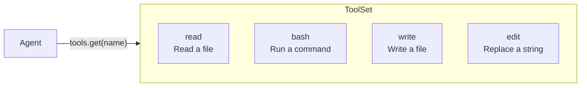
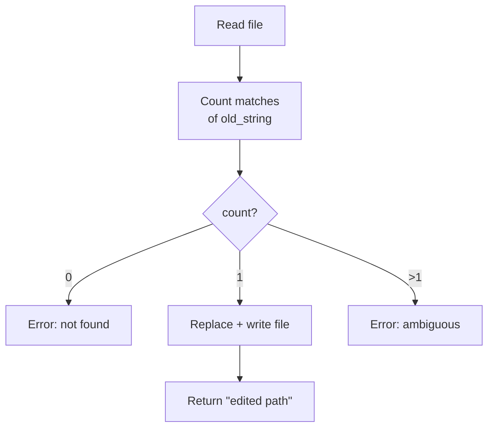

# Chương 4: Thêm nhiều tool

Bạn đã cài đặt `ReadTool` và hiểu pattern của trait `Tool`. Giờ đây bạn sẽ cài
đặt thêm ba tool nữa: `BashTool`, `WriteTool`, và `EditTool`. Mỗi tool đều đi
theo cùng một cấu trúc, định nghĩa schema, cài đặt `call()`, nên chương này sẽ
củng cố pattern đó bằng cách lặp lại có chủ đích.

Khi hoàn thành chương này, agent của bạn sẽ có đủ bốn tool cần thiết để tương
tác với filesystem và thực thi lệnh.



## Mục tiêu

Cài đặt ba tool:

1. **BashTool**: chạy một lệnh shell và trả về output của nó.
2. **WriteTool**: ghi nội dung vào file, tự tạo thư mục nếu cần.
3. **EditTool**: thay thế chính xác một chuỗi trong file, chuỗi đó phải xuất hiện đúng một lần.

## Các khái niệm Rust quan trọng

### `tokio::process::Command`

Tokio cung cấp một wrapper bất đồng bộ cho `std::process::Command`. Bạn sẽ dùng
nó trong `BashTool`:

```rust
let output = tokio::process::Command::new("bash")
    .arg("-c")
    .arg(command)
    .output()
    .await?;
```

Đoạn này chạy `bash -c "<command>"` và thu cả stdout lẫn stderr. Struct `output`
có các trường `stdout` và `stderr` dưới dạng `Vec<u8>`, sau đó bạn chuyển chúng
thành chuỗi bằng `String::from_utf8_lossy()`.

### Macro `bail!()`

Macro `anyhow::bail!()` là cách viết ngắn gọn để trả về lỗi ngay lập tức:

```rust
use anyhow::bail;

if count == 0 {
    bail!("not found");
}
// equivalent to:
// return Err(anyhow::anyhow!("not found"));
```

Bạn sẽ dùng nó trong `EditTool` cho phần kiểm tra hợp lệ.

Hãy nhớ import nó: `use anyhow::{Context, bail};`. File starter trong `edit.rs`
đã có sẵn import này rồi.

### `create_dir_all`

Khi ghi file vào một đường dẫn như `a/b/c/file.txt`, có thể các thư mục cha chưa
tồn tại. `tokio::fs::create_dir_all` sẽ tạo toàn bộ cây thư mục đó:

```rust
if let Some(parent) = std::path::Path::new(path).parent() {
    tokio::fs::create_dir_all(parent).await?;
}
```

---

## Tool 1: BashTool

Mở `mini-claw-code-starter/src/tools/bash.rs`.

### Schema

Hãy dùng builder pattern bạn đã học ở Chương 2:

```rust
ToolDefinition::new("bash", "Run a bash command and return its output.")
    .param("command", "string", "The bash command to run", true)
```

### Phần cài đặt

Method `call()` cần:

1. Lấy `"command"` từ args.
2. Chạy `bash -c <command>` bằng `tokio::process::Command`.
3. Thu stdout và stderr.
4. Tạo chuỗi kết quả:
   - Bắt đầu bằng stdout nếu nó không rỗng.
   - Nối thêm stderr với tiền tố `"stderr: "` nếu stderr không rỗng.
   - Nếu cả hai đều rỗng, trả về `"(no output)"`.

Hãy nghĩ về cách ghép stdout và stderr. Nếu cả hai cùng có dữ liệu, bạn nên
ngăn chúng bằng một ký tự xuống dòng. Ví dụ:

```rust
let mut result = String::new();
if !stdout.is_empty() {
    result.push_str(&stdout);
}
if !stderr.is_empty() {
    if !result.is_empty() {
        result.push('\n');
    }
    result.push_str("stderr: ");
    result.push_str(&stderr);
}
if result.is_empty() {
    result.push_str("(no output)");
}
```

---

## Tool 2: WriteTool

Mở `mini-claw-code-starter/src/tools/write.rs`.

### Schema

```rust
ToolDefinition::new("write", "Write content to a file, creating directories as needed.")
    .param("path", "string", "The file path to write to", true)
    .param("content", "string", "The content to write to the file", true)
```

### Phần cài đặt

Method `call()` cần:

1. Lấy `"path"` và `"content"` từ args.
2. Tạo các thư mục cha nếu chúng chưa tồn tại.
3. Ghi nội dung vào file.
4. Trả về thông báo xác nhận như `"wrote {path}"`.

Để tạo thư mục cha:

```rust
if let Some(parent) = std::path::Path::new(path).parent() {
    tokio::fs::create_dir_all(parent).await
        .with_context(|| format!("failed to create directories for '{path}'"))?;
}
```

Sau đó ghi file:

```rust
tokio::fs::write(path, content).await
    .with_context(|| format!("failed to write '{path}'"))?;
```

---

## Tool 3: EditTool

Mở `mini-claw-code-starter/src/tools/edit.rs`.

### Schema

```rust
ToolDefinition::new("edit", "Replace an exact string in a file (must appear exactly once).")
    .param("path", "string", "The file path to edit", true)
    .param("old_string", "string", "The exact string to find and replace", true)
    .param("new_string", "string", "The replacement string", true)
```

### Phần cài đặt

Method `call()` là phần thú vị nhất trong ba tool. Nó cần:

1. Lấy `"path"`, `"old_string"`, và `"new_string"` từ args.
2. Đọc nội dung file.
3. Đếm số lần `old_string` xuất hiện trong nội dung.
4. Nếu số lần là 0, trả về lỗi vì không tìm thấy chuỗi.
5. Nếu số lần lớn hơn 1, trả về lỗi vì chuỗi bị mơ hồ.
6. Thay thế đúng một lần xuất hiện và ghi file trở lại.
7. Trả về xác nhận như `"edited {path}"`.

Phần kiểm tra này rất quan trọng: bắt buộc đúng một lần khớp sẽ giúp tránh sửa
nhầm vị trí không mong muốn.



Một số API hữu ích:

- `content.matches(old).count()` đếm số lần xuất hiện của một substring.
- `content.replacen(old, new, 1)` thay thế lần xuất hiện đầu tiên.
- `bail!("old_string not found in '{path}'")` cho trường hợp không tìm thấy.
- `bail!("old_string appears {count} times in '{path}', must be unique")` cho
  trường hợp chuỗi xuất hiện quá nhiều lần.

---

## Chạy test

Chạy các test của Chương 4:

```bash
cargo test -p mini-claw-code-starter ch4
```

### Các test kiểm tra điều gì?

**BashTool:**
- **`test_ch4_bash_definition`**: kiểm tra tên là `"bash"` và `"command"` là
  tham số bắt buộc.
- **`test_ch4_bash_runs_command`**: chạy `echo hello` và kiểm tra output có
  chứa `"hello"`.
- **`test_ch4_bash_captures_stderr`**: chạy `echo err >&2` và kiểm tra stderr
  có được thu lại không.
- **`test_ch4_bash_missing_arg`**: truyền args rỗng và mong đợi lỗi.

**WriteTool:**
- **`test_ch4_write_definition`**: kiểm tra tên là `"write"`.
- **`test_ch4_write_creates_file`**: ghi vào một file tạm rồi đọc lại.
- **`test_ch4_write_creates_dirs`**: ghi vào `a/b/c/out.txt` và xác minh thư
  mục đã được tạo.
- **`test_ch4_write_missing_arg`**: chỉ truyền `"path"` mà không có `"content"`
  và mong đợi lỗi.

**EditTool:**
- **`test_ch4_edit_definition`**: kiểm tra tên là `"edit"`.
- **`test_ch4_edit_replaces_string`**: sửa `"hello"` thành `"goodbye"` trong
  một file chứa `"hello world"` và kiểm tra kết quả là `"goodbye world"`.
- **`test_ch4_edit_not_found`**: thử thay một chuỗi không tồn tại và mong đợi lỗi.
- **`test_ch4_edit_not_unique`**: thử thay `"a"` trong một file chứa `"aaa"`
  và mong đợi lỗi vì có nhiều lần khớp.

Ngoài ra còn có nhiều test tình huống biên cho từng tool như sai kiểu dữ liệu,
thiếu tham số, định dạng output, v.v. Chúng sẽ pass khi phần cài đặt cốt lõi
của bạn đúng.

## Tóm tắt

Bây giờ bạn đã có bốn tool, và tất cả đều đi theo cùng một pattern:

1. Định nghĩa `ToolDefinition` bằng các lời gọi builder `::new(...).param(...)`.
2. Trả về `&self.definition` từ `definition()`.
3. Thêm `#[async_trait::async_trait]` lên khối `impl Tool` rồi viết
   `async fn call()`.

Đây là một thiết kế có chủ đích. Trait `Tool` khiến mọi tool đều có thể được
đối xử như nhau từ góc nhìn của agent. Agent không cần biết bên trong tool hoạt
động thế nào, nó chỉ cần definition để mô tả cho LLM và method `call` để thực thi.

## Tiếp theo là gì?

Giờ bạn đã có provider và đủ bốn tool, đã đến lúc kết nối chúng lại với nhau.
Trong [Chương 5: Agent SDK đầu tiên của bạn!](./ch05-agent-loop.md), bạn sẽ xây
`SimpleAgent`, vòng lặp cốt lõi gửi prompt tới provider, thực thi tool call, và
lặp lại cho đến khi LLM đưa ra câu trả lời cuối cùng.
