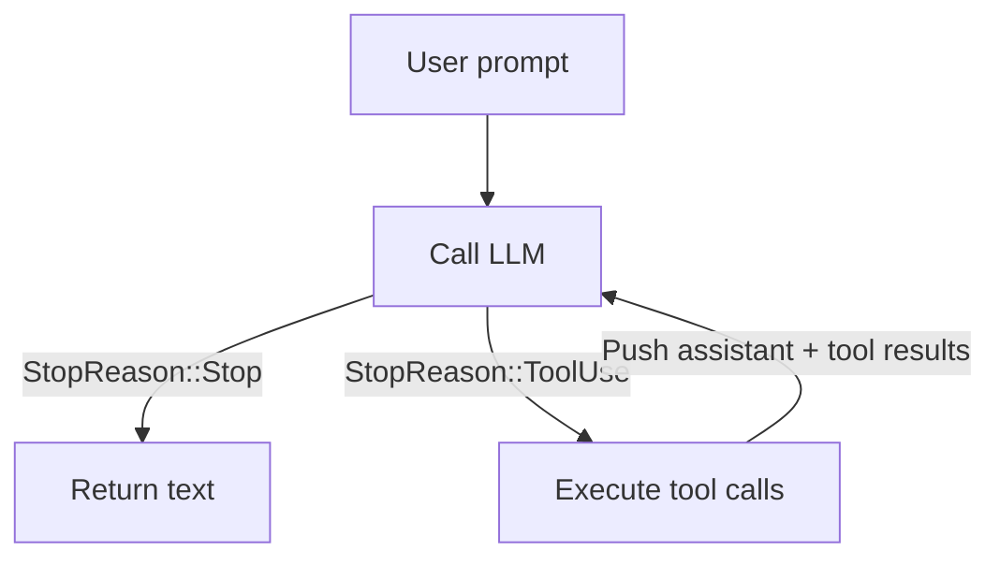

# Chương 5: Agent SDK đầu tiên của bạn!

Đây là chương nơi mọi mảnh ghép được nối lại với nhau. Bạn đã có một provider
trả về các phản hồi `AssistantTurn` và bốn tool có thể thực thi hành động. Giờ
bạn sẽ xây dựng `SimpleAgent` -- vòng lặp kết nối toàn bộ chúng.

Đây chính là khoảnh khắc "à, ra là vậy!" của cả tutorial. Vòng lặp agent ngắn
hơn bạn tưởng, nhưng nó là cỗ máy biến một LLM thành một agent thực thụ.

## Agent loop là gì?

Ở Chương 3, bạn đã xây `single_turn()` -- một prompt, một vòng tool call, rồi
một câu trả lời cuối cùng. Cách đó đủ dùng khi LLM biết hết mọi thứ nó cần chỉ
sau khi đọc một file. Nhưng các tác vụ thực tế lộn xộn hơn nhiều:

> "Tìm bug trong project này rồi sửa nó."

LLM có thể phải đọc năm file, chạy test suite, chỉnh sửa một file nguồn, chạy
test lại, rồi mới báo kết quả. Mỗi bước trong số đó là một tool call, và LLM
không thể lên kế hoạch toàn bộ ngay từ đầu vì kết quả của bước trước quyết
định bước kế tiếp. Nó cần một **vòng lặp**.

Agent loop chính là vòng lặp đó:



1. Gửi các message cho LLM.
2. Nếu LLM nói "Tôi xong rồi" (`StopReason::Stop`), trả về phần text của nó.
3. Nếu LLM nói "Tôi cần tool" (`StopReason::ToolUse`), thực thi các tool đó.
4. Nối thêm assistant turn và các tool result vào lịch sử message.
5. Quay lại bước 1.

Đó là toàn bộ kiến trúc của mọi coding agent -- Claude Code, Cursor, OpenCode,
Copilot. Chi tiết có thể khác nhau (streaming, tool call song song, lớp kiểm
soát an toàn), nhưng vòng lõi luôn như nhau. Và bạn sắp tự xây nó chỉ với
khoảng 30 dòng Rust.

## Mục tiêu

Hãy triển khai `SimpleAgent` sao cho:

1. Nó giữ một provider và một tập các tool.
2. Bạn có thể đăng ký tool bằng builder pattern (`.tool(ReadTool::new())`).
3. Phương thức `run()` triển khai vòng lặp gọi tool: prompt -> provider ->
   tool calls -> tool results -> provider -> ... -> final text.

## Các khái niệm Rust chính

### Generic với trait bound

```rust
pub struct SimpleAgent<P: Provider> {
    provider: P,
    tools: ToolSet,
}
```

`<P: Provider>` nghĩa là `SimpleAgent` mang tính generic trên bất kỳ kiểu nào
triển khai trait `Provider`. Khi bạn dùng `MockProvider`, compiler sinh mã
được chuyên biệt hóa cho `MockProvider`. Khi bạn dùng `OpenRouterProvider`, nó
sinh mã cho kiểu đó. Cùng một logic, khác provider.

### `ToolSet` -- một HashMap chứa trait object

Trường `tools` là một `ToolSet`, bên trong nó bọc một
`HashMap<String, Box<dyn Tool>>`. Mỗi value là một *trait object* nằm trên heap
triển khai `Tool`, nhưng kiểu cụ thể có thể khác nhau. Một phần tử có thể là
`ReadTool`, phần tử kế tiếp có thể là `BashTool`. Key của HashMap là tên của
tool, cho phép tra cứu O(1) khi thực thi tool call.

Vì sao dùng trait object (`Box<dyn Tool>`) thay vì generic? Bởi vì bạn cần một
**heterogeneous collection**. Một `Vec<T>` đòi hỏi mọi phần tử cùng kiểu. Với
`Box<dyn Tool>`, bạn xóa bỏ kiểu cụ thể và lưu tất cả chúng sau cùng một giao
diện thống nhất.

Đó là lý do trait `Tool` dùng `#[async_trait]` -- macro này biến `async fn`
thành boxed future với kiểu thống nhất trên các implementation khác nhau của
tool.

### Builder pattern

Phương thức `tool()` nhận `self` theo giá trị (không phải `&mut self`) và trả
về `Self`:

```rust
pub fn tool(mut self, t: impl Tool + 'static) -> Self {
    // push the tool
    self
}
```

Nhờ đó bạn có thể chain nhiều lời gọi:

```rust
let agent = SimpleAgent::new(provider)
    .tool(BashTool::new())
    .tool(ReadTool::new())
    .tool(WriteTool::new())
    .tool(EditTool::new());
```

Tham số `impl Tool + 'static` chấp nhận bất kỳ kiểu nào triển khai `Tool` với
lifetime `'static` (nghĩa là nó không mượn dữ liệu tạm thời). Bên trong
phương thức, bạn đẩy nó vào `ToolSet`, nơi nó được box lại và đánh chỉ mục
theo tên.

## Phần triển khai

Mở `mini-claw-code-starter/src/agent.rs`. Phần định nghĩa struct và chữ ký các
phương thức đã được cung cấp sẵn.

### Bước 1: Triển khai `new()`

Lưu provider và khởi tạo một `ToolSet` rỗng:

```rust
pub fn new(provider: P) -> Self {
    Self {
        provider,
        tools: ToolSet::new(),
    }
}
```

Phần này khá đơn giản.

### Bước 2: Triển khai `tool()`

Đẩy tool vào tập rồi trả về `self`:

```rust
pub fn tool(mut self, t: impl Tool + 'static) -> Self {
    self.tools.push(t);
    self
}
```

### Bước 3: Triển khai `run()` -- vòng lặp lõi

Đây là trái tim của agent. Luồng xử lý như sau:

1. Thu thập tool definition từ tất cả các tool đã đăng ký.
2. Tạo vector `messages` bắt đầu bằng prompt của người dùng.
3. Lặp:
   a. Gọi `self.provider.chat(&messages, &defs)` để nhận một `AssistantTurn`.
   b. `match` trên `turn.stop_reason`:
      - `StopReason::Stop` -- LLM đã xong, trả về `turn.text`.
      - `StopReason::ToolUse` -- với mỗi tool call:
        1. Tìm tool tương ứng theo tên.
        2. Gọi tool với phần arguments.
        3. Thu thập kết quả.
   c. Đẩy `AssistantTurn` vào dưới dạng `Message::Assistant`.
   d. Đẩy từng tool result vào dưới dạng `Message::ToolResult`.
   e. Tiếp tục vòng lặp.

Hãy nghĩ kỹ về luồng dữ liệu. Sau khi thực thi tool, bạn đẩy vào *cả* assistant
turn (để LLM thấy chính xác nó đã yêu cầu gì) *lẫn* tool result (để nó thấy
điều gì đã xảy ra). Nhờ vậy LLM có đủ ngữ cảnh để quyết định bước tiếp theo.

### Thu thập tool definition

Ở đầu `run()`, hãy gom tất cả tool definition từ `ToolSet`:

```rust
let defs = self.tools.definitions();
```

### Cấu trúc vòng lặp

Đây chính là `single_turn()` (từ Chương 3) được bọc trong một vòng lặp. Thay
vì chỉ xử lý một lượt, ta `match` trên `stop_reason` bên trong `loop`:

```rust
loop {
    let turn = self.provider.chat(&messages, &defs).await?;

    match turn.stop_reason {
        StopReason::Stop => return Ok(turn.text.unwrap_or_default()),
        StopReason::ToolUse => {
            // Execute tool calls, collect results
            // Push messages
        }
    }
}
```

### Tìm và gọi tool

Với mỗi tool call, tra cứu nó theo tên trong `ToolSet`:

```rust
println!("{}", tool_summary(call));
let content = match self.tools.get(&call.name) {
    Some(t) => t.call(call.arguments.clone()).await
        .unwrap_or_else(|e| format!("error: {e}")),
    None => format!("error: unknown tool `{}`", call.name),
};
```

Helper `tool_summary()` sẽ in từng tool call ra terminal -- mỗi tool một dòng
cùng với đối số quan trọng nhất, để bạn có thể quan sát agent đang làm gì theo
thời gian thực. Ví dụ: `[bash: cat Cargo.toml]` hoặc `[write: src/lib.rs]`.

### Xử lý lỗi

Lỗi của tool được bắt bằng `.unwrap_or_else()` rồi chuyển thành chuỗi để gửi
trở lại LLM dưới dạng tool result. Đây cũng là mẫu bạn đã dùng ở Chương 3, và
nó cực kỳ quan trọng ở đây vì agent loop sẽ chạy qua nhiều vòng. Nếu lỗi tool
làm crash cả vòng lặp, agent sẽ chết ngay khi gặp file thiếu hoặc lệnh thất
bại đầu tiên. Thay vào đó, LLM sẽ nhìn thấy lỗi và có thể tự phục hồi -- thử
một đường dẫn khác, chỉnh lại câu lệnh, hoặc giải thích vấn đề.

```text
> What's in README.md?
[read: README.md]          <-- tool fails (file not found)
[read: Cargo.toml]         <-- LLM recovers, tries another file
Here is the project info from Cargo.toml...
```

Tool không tồn tại cũng được xử lý tương tự -- trả về chuỗi lỗi làm tool
result, chứ không làm chương trình crash.

### Đẩy message vào lịch sử

Sau khi thực thi xong tất cả tool call cho một turn, hãy đẩy assistant message
và toàn bộ tool result. Bạn cần thu kết quả trước (vì `turn` sẽ bị move vào
`Message::Assistant`):

```rust
let mut results = Vec::new();
for call in &turn.tool_calls {
    // ... execute and collect (id, content) pairs
}

messages.push(Message::Assistant(turn));
for (id, content) in results {
    messages.push(Message::ToolResult { id, content });
}
```

Thứ tự này rất quan trọng: assistant message trước, rồi mới tới tool result.
Đây là đúng với định dạng mà các LLM API mong đợi.

## Chạy test

Chạy bộ test của Chương 5:

```bash
cargo test -p mini-claw-code-starter ch5
```

### Test kiểm tra điều gì

- **`test_ch5_text_response`**: Provider trả text ngay lập tức (không cần tool).
  Agent phải trả lại đúng phần text đó.
- **`test_ch5_single_tool_call`**: Provider trước tiên yêu cầu một `read`
  tool call, sau đó mới trả text. Agent phải thực thi tool rồi trả text cuối
  cùng.
- **`test_ch5_unknown_tool`**: Provider yêu cầu một tool không tồn tại. Agent
  phải xử lý êm (trả chuỗi lỗi như tool result) rồi tiếp tục để lấy text cuối.
- **`test_ch5_multi_step_loop`**: Provider yêu cầu `read` hai lần qua hai
  turn, rồi mới trả text. Test này xác minh vòng lặp chạy được qua nhiều lượt.
- **`test_ch5_empty_response`**: Provider trả `None` cho text và không có tool
  call nào. Agent phải trả về chuỗi rỗng.
- **`test_ch5_builder_chain`**: Kiểm tra việc chain `.tool().tool()` có biên
  dịch được hay không -- đây là một compile-time check cho builder pattern.
- **`test_ch5_tool_error_propagates`**: Provider yêu cầu `read` một file không
  tồn tại. Lỗi phải được bắt lại và gửi trả như tool result. Sau đó LLM trả về
  text. Test này xác minh vòng lặp không crash khi tool thất bại.

Ngoài ra còn có thêm nhiều edge-case test khác (vòng lặp ba bước, pipeline
nhiều tool, v.v.) sẽ tự qua khi phần triển khai lõi của bạn đúng.

## Nhìn toàn bộ hệ thống hoạt động

Khi test đã qua, hãy dừng lại một chút để nhìn xem bạn vừa xây được gì. Chỉ
với khoảng 30 dòng mã trong `run()`, bạn đã có một agent loop hoàn chỉnh. Đây
là điều xảy ra khi một test chạy `agent.run("Read test.txt")`:

1. Messages: `[User("Read test.txt")]`
2. Provider trả về: tool call `read` với `{"path": "test.txt"}`
3. Agent gọi `ReadTool::call()`, nhận nội dung file
4. Messages: `[User("Read test.txt"), Assistant(tool_call), ToolResult("file content")]`
5. Provider trả về: phản hồi dạng text
6. Agent trả lại đoạn text đó

`MockProvider` khiến toàn bộ quy trình này trở nên xác định và dễ test. Nhưng
chính vòng lặp đó cũng hoạt động nguyên vẹn với provider LLM thật -- bạn chỉ
cần thay `MockProvider` bằng `OpenRouterProvider`.

## Tóm tắt

Agent loop là lõi của cả framework:

- **Generic** (`<P: Provider>`) giúp nó làm việc với bất kỳ provider nào.
- **`ToolSet`** (HashMap chứa `Box<dyn Tool>`) cho phép tra cứu tool theo tên
  với O(1).
- **Builder pattern** giúp phần khởi tạo gọn và dễ đọc.
- **Khả năng chịu lỗi** -- lỗi từ tool được bắt lại và gửi về cho LLM, không
  bị propagate ra ngoài. Vòng lặp không crash chỉ vì một tool lỗi.
- **Vòng lặp** rất đơn giản: gọi provider, `match` theo `stop_reason`, thực
  thi tool, đưa kết quả trở lại, rồi lặp tiếp.

## Tiếp theo là gì

Agent của bạn đã chạy, nhưng hiện mới chỉ dùng mock provider. Ở
[Chương 6: OpenRouter Provider](./ch06-http-provider.md), bạn sẽ triển khai
`OpenRouterProvider`, thứ giao tiếp với một LLM API thật qua HTTP. Đây là bước
biến agent của bạn từ bộ khung kiểm thử thành một công cụ thực sự có thể dùng.
