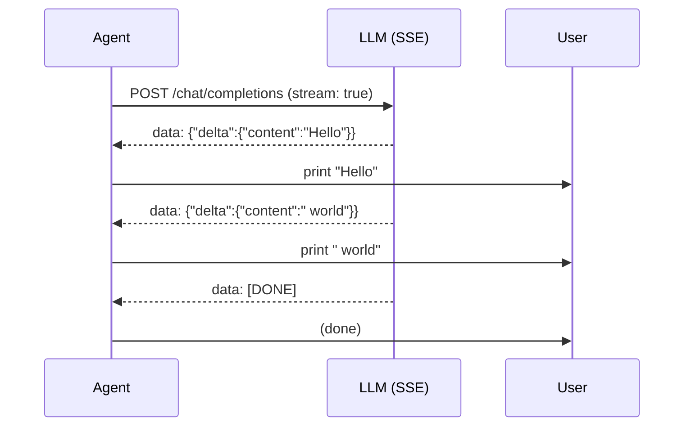
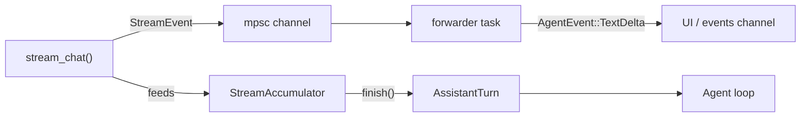

# Chương 10: Streaming

Ở Chương 6, bạn đã xây dựng `OpenRouterProvider::chat()`, hàm này chờ đến khi
nhận được *toàn bộ* phản hồi rồi mới trả về. Cách đó vẫn chạy được, nhưng người
dùng sẽ phải nhìn một màn hình trống cho đến khi mọi token đã được tạo xong.
Các coding agent thực tế in token ra ngay khi chúng xuất hiện, đó chính là
streaming.

Chương này sẽ bổ sung hỗ trợ streaming và một `StreamingAgent`, tức phiên bản
streaming của `SimpleAgent`. Bạn sẽ:

1. Định nghĩa enum `StreamEvent` để biểu diễn các delta thời gian thực.
2. Xây dựng `StreamAccumulator` để gom các delta thành một `AssistantTurn` hoàn chỉnh.
3. Viết hàm `parse_sse_line()` để chuyển raw Server-Sent Events thành `StreamEvent`.
4. Định nghĩa trait `StreamProvider`, phiên bản streaming của `Provider`.
5. Triển khai `StreamProvider` cho `OpenRouterProvider`.
6. Xây dựng `MockStreamProvider` để test mà không cần HTTP.
7. Xây dựng `StreamingAgent<P: StreamProvider>`, một agent loop hoàn chỉnh có
   streaming text theo thời gian thực.

Không có phần nào trong số này chạm vào trait `Provider` hay `SimpleAgent`.
Streaming được chồng thêm *ở phía trên* kiến trúc hiện có.

## Tại sao cần streaming?

Nếu không có streaming, một phản hồi dài, ví dụ 500 token, sẽ khiến CLI trông
như bị treo. Streaming giải quyết ba vấn đề:

- **Phản hồi ngay lập tức**: người dùng thấy từ đầu tiên chỉ sau vài mili giây
  thay vì đợi vài giây cho toàn bộ phản hồi.
- **Có thể hủy sớm**: nếu agent đang đi sai hướng, người dùng có thể nhấn
  Ctrl-C mà không cần chờ đến cuối.
- **Thấy được tiến trình**: việc nhìn token chạy ra giúp xác nhận agent đang
  làm việc chứ không bị kẹt.

## SSE hoạt động như thế nào

API tương thích OpenAI hỗ trợ streaming thông qua
[Server-Sent Events (SSE)](https://developer.mozilla.org/en-US/docs/Web/API/Server-sent_events).
Bạn đặt `"stream": true` trong request, và thay vì nhận một JSON lớn duy nhất,
server sẽ gửi một chuỗi các dòng text:

```text
data: {"choices":[{"delta":{"content":"Hello"},"finish_reason":null}]}

data: {"choices":[{"delta":{"content":" world"},"finish_reason":null}]}

data: {"choices":[{"delta":{},"finish_reason":"stop"}]}

data: [DONE]
```

Mỗi dòng bắt đầu bằng `data: `, theo sau là một object JSON hoặc sentinel
`[DONE]`. Khác biệt quan trọng so với phản hồi không-stream là thay vì có
trường `message` chứa toàn bộ nội dung, mỗi chunk chỉ có trường `delta` chứa
*phần mới xuất hiện*. Code của bạn sẽ đọc lần lượt các delta này, in ra ngay
lập tức, đồng thời tích lũy chúng thành kết quả cuối.

Luồng xử lý trông như sau:



Tool call cũng được stream theo cách tương tự, nhưng dùng delta `tool_calls`
thay vì delta `content`. Tên tool và phần arguments của lời gọi sẽ đến theo từng
mảnh, và bạn cần nối các mảnh đó lại.

## `StreamEvent`

Mở `mini-claw-code/src/streaming.rs`. Enum `StreamEvent` là kiểu dữ liệu domain
của chúng ta cho các delta streaming:

```rust
#[derive(Debug, Clone, PartialEq)]
pub enum StreamEvent {
    /// A chunk of assistant text.
    TextDelta(String),
    /// A new tool call has started.
    ToolCallStart { index: usize, id: String, name: String },
    /// More argument JSON for a tool call in progress.
    ToolCallDelta { index: usize, arguments: String },
    /// The stream is complete.
    Done,
}
```

Đây là giao diện giữa bộ parser SSE và phần còn lại của ứng dụng. Parser tạo ra
`StreamEvent`, UI tiêu thụ chúng để hiển thị, còn accumulator gom chúng thành
một `AssistantTurn`.

## `StreamAccumulator`

Accumulator là một state machine đơn giản. Nó giữ một buffer `text` đang tăng
dần và một danh sách các tool call chưa hoàn chỉnh. Mỗi lần gọi `feed()` sẽ
nối dữ liệu mới vào đúng vị trí:

```rust
pub struct StreamAccumulator {
    text: String,
    tool_calls: Vec<PartialToolCall>,
}

impl StreamAccumulator {
    pub fn new() -> Self { /* ... */ }
    pub fn feed(&mut self, event: &StreamEvent) { /* ... */ }
    pub fn finish(self) -> AssistantTurn { /* ... */ }
}
```

Implementation rất thẳng:

- **`TextDelta`**: nối thêm vào `self.text`.
- **`ToolCallStart`**: nếu cần thì mở rộng vec `tool_calls`, rồi đặt `id` và
  `name` ở đúng `index`.
- **`ToolCallDelta`**: nối thêm vào chuỗi arguments ở `index` tương ứng.
- **`Done`**: không làm gì, vì việc kết thúc được xử lý trong `finish()`.

`finish()` sẽ consume accumulator và xây dựng một `AssistantTurn`:

```rust
pub fn finish(self) -> AssistantTurn {
    let text = if self.text.is_empty() { None } else { Some(self.text) };

    let tool_calls: Vec<ToolCall> = self.tool_calls
        .into_iter()
        .filter(|tc| !tc.name.is_empty())
        .map(|tc| ToolCall {
            id: tc.id,
            name: tc.name,
            arguments: serde_json::from_str(&tc.arguments)
                .unwrap_or(Value::Null),
        })
        .collect();

    let stop_reason = if tool_calls.is_empty() {
        StopReason::Stop
    } else {
        StopReason::ToolUse
    };

    AssistantTurn { text, tool_calls, stop_reason }
}
```

Hãy lưu ý rằng `arguments` được gom dưới dạng chuỗi thô và chỉ parse thành JSON
ở bước cuối cùng. Lý do là API sẽ gửi những mảnh như `{"pa` và
`th": "f.txt"}`, chúng chưa phải JSON hợp lệ cho đến khi được ghép lại đầy đủ.

## Parse từng dòng SSE

Hàm `parse_sse_line()` nhận vào một dòng đơn từ luồng SSE và trả về zero hoặc
nhiều `StreamEvent`:

```rust
pub fn parse_sse_line(line: &str) -> Option<Vec<StreamEvent>> {
    let data = line.strip_prefix("data: ")?;

    if data == "[DONE]" {
        return Some(vec![StreamEvent::Done]);
    }

    let chunk: ChunkResponse = serde_json::from_str(data).ok()?;
    // ... extract events from chunk.choices[0].delta
}
```

Các kiểu dữ liệu cho SSE chunk sẽ phản chiếu đúng định dạng delta của OpenAI:

```rust
#[derive(Deserialize)]
struct ChunkResponse { choices: Vec<ChunkChoice> }

#[derive(Deserialize)]
struct ChunkChoice { delta: Delta, finish_reason: Option<String> }

#[derive(Deserialize)]
struct Delta {
    content: Option<String>,
    tool_calls: Option<Vec<DeltaToolCall>>,
}
```

Với tool call, chunk đầu tiên sẽ có `id` và `function.name`, báo hiệu một tool
call mới bắt đầu. Các chunk tiếp theo chỉ chứa những mảnh `function.arguments`.
Parser sẽ phát `ToolCallStart` khi thấy `id`, và phát `ToolCallDelta` cho các
chuỗi arguments không rỗng.

## Trait `StreamProvider`

Giống như `Provider` định nghĩa giao diện không-streaming, `StreamProvider`
định nghĩa giao diện streaming:

```rust
pub trait StreamProvider: Send + Sync {
    fn stream_chat<'a>(
        &'a self,
        messages: &'a [Message],
        tools: &'a [&'a ToolDefinition],
        tx: mpsc::UnboundedSender<StreamEvent>,
    ) -> impl Future<Output = anyhow::Result<AssistantTurn>> + Send + 'a;
}
```

Khác biệt then chốt với `Provider::chat()` là tham số `tx`, một sender của
`mpsc` channel. Implementation sẽ gửi các `StreamEvent` qua channel này ngay khi
chúng xuất hiện, *đồng thời* vẫn trả về `AssistantTurn` cuối cùng đã được tích
lũy hoàn chỉnh. Nhờ vậy caller vừa nhận được sự kiện thời gian thực, vừa có
được kết quả hoàn chỉnh.

Ta giữ `StreamProvider` tách biệt với `Provider` thay vì thêm một method mới vào
trait cũ. Cách này giúp `SimpleAgent` và toàn bộ code hiện tại không bị ảnh hưởng.

## Triển khai `StreamProvider` cho `OpenRouterProvider`

Implementation này ghép SSE parser, accumulator và channel lại với nhau:

```rust
impl StreamProvider for OpenRouterProvider {
    async fn stream_chat(
        &self,
        messages: &[Message],
        tools: &[&ToolDefinition],
        tx: mpsc::UnboundedSender<StreamEvent>,
    ) -> anyhow::Result<AssistantTurn> {
        // 1. Build request with stream: true
        // 2. Send HTTP request
        // 3. Read response chunks in a loop:
        //    - Buffer incoming bytes
        //    - Split on newlines
        //    - parse_sse_line() each complete line
        //    - feed() each event into the accumulator
        //    - send each event through tx
        // 4. Return acc.finish()
    }
}
```

Chi tiết về buffer là phần quan trọng. Phản hồi HTTP có thể đến theo các chunk
byte tùy ý, không khớp với ranh giới từng dòng SSE. Vì vậy ta duy trì một
`String` buffer, nối thêm từng chunk, và chỉ xử lý những dòng hoàn chỉnh
(tách theo `\n`):

```rust
let mut buffer = String::new();

while let Some(chunk) = resp.chunk().await? {
    buffer.push_str(&String::from_utf8_lossy(&chunk));

    while let Some(newline_pos) = buffer.find('\n') {
        let line = buffer[..newline_pos].trim_end_matches('\r').to_string();
        buffer = buffer[newline_pos + 1..].to_string();

        if line.is_empty() { continue; }

        if let Some(events) = parse_sse_line(&line) {
            for event in events {
                acc.feed(&event);
                let _ = tx.send(event);
            }
        }
    }
}
```

## `MockStreamProvider`

Để test, ta cần một streaming provider không hề gọi HTTP. `MockStreamProvider`
bọc quanh `MockProvider` hiện có và tự tổng hợp ra `StreamEvent` từ từng
`AssistantTurn` dựng sẵn:

```rust
pub struct MockStreamProvider {
    inner: MockProvider,
}

impl StreamProvider for MockStreamProvider {
    async fn stream_chat(
        &self,
        messages: &[Message],
        tools: &[&ToolDefinition],
        tx: mpsc::UnboundedSender<StreamEvent>,
    ) -> anyhow::Result<AssistantTurn> {
        let turn = self.inner.chat(messages, tools).await?;

        // Synthesize stream events from the complete turn
        if let Some(ref text) = turn.text {
            for ch in text.chars() {
                let _ = tx.send(StreamEvent::TextDelta(ch.to_string()));
            }
        }
        for (i, call) in turn.tool_calls.iter().enumerate() {
            let _ = tx.send(StreamEvent::ToolCallStart {
                index: i, id: call.id.clone(), name: call.name.clone(),
            });
            let _ = tx.send(StreamEvent::ToolCallDelta {
                index: i, arguments: call.arguments.to_string(),
            });
        }
        let _ = tx.send(StreamEvent::Done);

        Ok(turn)
    }
}
```

Nó gửi text theo từng ký tự một, mô phỏng cảm giác token-by-token, và với mỗi
tool call nó gửi một cặp sự kiện start + delta. Nhờ đó ta có thể test
`StreamingAgent` mà không cần bất kỳ kết nối mạng nào.

## `StreamingAgent`

Giờ đến phần quan trọng nhất. `StreamingAgent` là phiên bản streaming của
`SimpleAgent`. Nó có cấu trúc tương tự, vẫn là một provider, một tool set và
một agent loop, nhưng dùng `StreamProvider` và phát `AgentEvent::TextDelta`
theo thời gian thực:

```rust
pub struct StreamingAgent<P: StreamProvider> {
    provider: P,
    tools: ToolSet,
}

impl<P: StreamProvider> StreamingAgent<P> {
    pub fn new(provider: P) -> Self { /* ... */ }
    pub fn tool(mut self, t: impl Tool + 'static) -> Self { /* ... */ }

    pub async fn run(
        &self,
        prompt: &str,
        events: mpsc::UnboundedSender<AgentEvent>,
    ) -> anyhow::Result<String> { /* ... */ }

    pub async fn chat(
        &self,
        messages: &mut Vec<Message>,
        events: mpsc::UnboundedSender<AgentEvent>,
    ) -> anyhow::Result<String> { /* ... */ }
}
```

Phương thức `chat()` là trái tim của streaming agent. Hãy đi qua nó từng bước:

```rust
pub async fn chat(
    &self,
    messages: &mut Vec<Message>,
    events: mpsc::UnboundedSender<AgentEvent>,
) -> anyhow::Result<String> {
    let defs = self.tools.definitions();

    loop {
        // 1. Set up a stream channel
        let (stream_tx, mut stream_rx) = mpsc::unbounded_channel();

        // 2. Spawn a forwarder that converts StreamEvent::TextDelta
        //    into AgentEvent::TextDelta for the UI
        let events_clone = events.clone();
        let forwarder = tokio::spawn(async move {
            while let Some(event) = stream_rx.recv().await {
                if let StreamEvent::TextDelta(text) = event {
                    let _ = events_clone.send(AgentEvent::TextDelta(text));
                }
            }
        });

        // 3. Call stream_chat — this streams AND returns the turn
        let turn = self.provider.stream_chat(messages, &defs, stream_tx).await?;
        let _ = forwarder.await;

        // 4. Same stop_reason logic as SimpleAgent
        match turn.stop_reason {
            StopReason::Stop => {
                let text = turn.text.clone().unwrap_or_default();
                let _ = events.send(AgentEvent::Done(text.clone()));
                messages.push(Message::Assistant(turn));
                return Ok(text);
            }
            StopReason::ToolUse => {
                // Execute tools, push results, continue loop
                // (same pattern as SimpleAgent)
            }
        }
    }
}
```

Kiến trúc ở đây có hai channel chạy đồng thời:



Forwarder task đóng vai trò cầu nối: nó nhận các `StreamEvent` thô từ provider
và chuyển riêng `TextDelta` thành `AgentEvent::TextDelta` cho UI. Cách này giữ
giao thức streaming của provider tách biệt khỏi giao thức event của agent.

Hãy chú ý rằng `AgentEvent` giờ đã có thêm biến thể `TextDelta`:

```rust
pub enum AgentEvent {
    TextDelta(String),  // NEW — streaming text chunks
    ToolCall { name: String, summary: String },
    Done(String),
    Error(String),
}
```

## Dùng `StreamingAgent` trong TUI

Ví dụ TUI (`examples/tui.rs`) dùng `StreamingAgent` để đem lại trải nghiệm đầy đủ:

```rust
let provider = OpenRouterProvider::from_env()?;
let agent = Arc::new(
    StreamingAgent::new(provider)
        .tool(BashTool::new())
        .tool(ReadTool::new())
        .tool(WriteTool::new())
        .tool(EditTool::new()),
);
```

Agent được bọc trong `Arc` để có thể chia sẻ cho các task được spawn. Mỗi turn
sẽ spawn agent và xử lý event cùng spinner:

```rust
let (tx, mut rx) = mpsc::unbounded_channel();
let agent = agent.clone();
let mut msgs = std::mem::take(&mut history);
let handle = tokio::spawn(async move {
    let _ = agent.chat(&mut msgs, tx).await;
    msgs
});

// UI event loop — print TextDeltas, show spinner for tool calls
loop {
    tokio::select! {
        event = rx.recv() => {
            match event {
                Some(AgentEvent::TextDelta(text)) => print!("{text}"),
                Some(AgentEvent::ToolCall { summary, .. }) => { /* spinner */ },
                Some(AgentEvent::Done(_)) => break,
                // ...
            }
        }
        _ = tick.tick() => { /* animate spinner */ }
    }
}
```

Hãy so với phiên bản `SimpleAgent` ở Chương 9: cấu trúc hầu như giống hệt. Khác
biệt duy nhất là `TextDelta` cho phép ta in token ngay khi chúng xuất hiện thay
vì phải chờ đến `Done`.

## Chạy test

```bash
cargo test -p mini-claw-code ch10
```

Các test sẽ kiểm tra:

- **Accumulator**: ghép text, ghép tool call, trường hợp trộn event, input rỗng,
  nhiều tool call song song.
- **SSE parsing**: text delta, tool call start/delta, `[DONE]`, dòng không phải
  `data:`, delta rỗng, JSON lỗi, và chuỗi nhiều dòng đầy đủ.
- **MockStreamProvider**: phản hồi text được tổng hợp thành event từng ký tự;
  phản hồi tool call được tổng hợp thành cặp start + delta.
- **StreamingAgent**: phản hồi chỉ có text, loop với tool call, và history qua
  nhiều turn, tất cả đều dùng `MockStreamProvider` để cho test quyết định.
- **Integration**: dùng mock TCP server gửi SSE thật cho `stream_chat()`, rồi
  kiểm tra cả `AssistantTurn` trả về lẫn các event đã được gửi qua channel.

## Tổng kết

- **`StreamEvent`** biểu diễn các delta thời gian thực: mảnh text, bắt đầu
  tool call, mảnh arguments và tín hiệu hoàn tất.
- **`StreamAccumulator`** gom các delta thành một `AssistantTurn` đầy đủ.
- **`parse_sse_line()`** chuyển raw `data:` line của SSE thành `StreamEvent`.
- **`StreamProvider`** là phiên bản streaming của `Provider`: nó thêm tham số
  `mpsc` channel để gửi sự kiện thời gian thực.
- **`MockStreamProvider`** bọc `MockProvider` để tổng hợp sự kiện streaming cho test.
- **`StreamingAgent`** là phiên bản streaming của `SimpleAgent`: cùng tool loop,
  nhưng có `TextDelta` được đẩy tới UI theo thời gian thực.
- Trait `Provider` và `SimpleAgent` **không thay đổi**. Streaming chỉ là một
  lớp tính năng cộng thêm ở phía trên.
