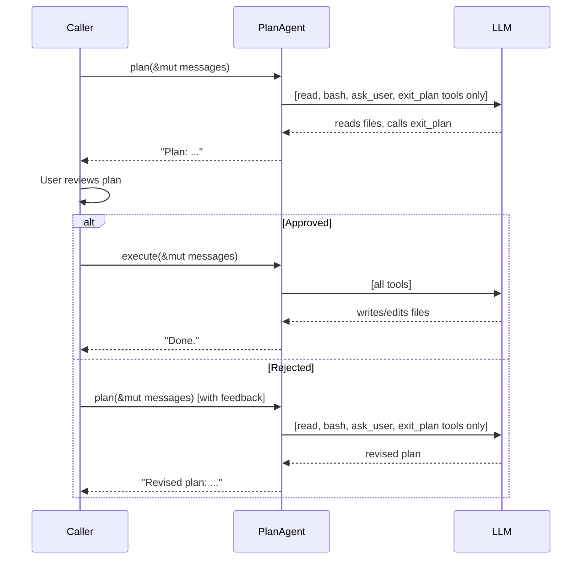

# Chương 12: Chế độ lập kế hoạch

Coding agent ngoài đời thực có thể khá nguy hiểm. Nếu trao cho LLM quyền dùng
`write`, `edit` và `bash`, nó có thể viết lại config của bạn, xóa file, hoặc
chạy một lệnh phá hủy nào đó trước cả khi bạn kịp xem nó đang làm gì.

**Plan mode** giải quyết vấn đề này bằng một quy trình hai giai đoạn:

1. **Plan**: agent khám phá codebase bằng các tool chỉ-đọc (`read`, `bash`,
   và `ask_user`). Nó không thể ghi, sửa, hay thay đổi bất cứ thứ gì. Nó chỉ
   trả về một kế hoạch mô tả điều nó định làm.
2. **Execute**: sau khi người dùng xem và chấp thuận kế hoạch, agent chạy lại
   với toàn bộ tool được mở khóa.

Đây chính là cách plan mode của Claude Code hoạt động. Trong chương này bạn sẽ
xây dựng `PlanAgent`, một streaming agent có cổng approval do caller điều khiển.

Bạn sẽ làm các việc sau:

1. Xây dựng `PlanAgent<P: StreamProvider>` với hai phương thức `plan()` và `execute()`.
2. Chèn một **system prompt** để nói cho LLM biết nó đang ở planning mode.
3. Thêm một tool **`exit_plan`** để LLM gọi khi kế hoạch đã sẵn sàng.
4. Triển khai **double defense**: vừa lọc tool definition, vừa có execution guard.
5. Để caller tự điều khiển luồng approval giữa hai giai đoạn.

## Tại sao cần plan mode?

Hãy xem tình huống sau:

```text
User: "Refactor auth.rs to use JWT instead of session cookies"

Agent (no plan mode):
  → calls write("auth.rs", ...) immediately
  → rewrites half your auth system
  → you didn't want that approach at all
```

Khi có plan mode:

```text
User: "Refactor auth.rs to use JWT instead of session cookies"

Agent (plan phase):
  → calls read("auth.rs") to understand current code
  → calls bash("grep -r 'session' src/") to find related files
  → calls exit_plan to submit its plan
  → "Plan: Replace SessionStore with JwtProvider in 3 files..."

User: "Looks good, go ahead."

Agent (execute phase):
  → calls write/edit with the approved changes
```

Ý chính ở đây là: **cùng một agent loop có thể dùng cho cả hai giai đoạn**.
Điểm khác biệt duy nhất là *tool nào được phép xuất hiện*.

## Thiết kế

`PlanAgent` có hình dạng giống `StreamingAgent`: một provider, một `ToolSet`,
và một agent loop. Có ba phần bổ sung để biến nó thành planning agent:

1. Một `HashSet<&'static str>` ghi lại những tool nào được phép dùng trong lúc lập kế hoạch.
2. Một **system prompt** được chèn vào đầu giai đoạn planning.
3. Một **định nghĩa tool `exit_plan`** để LLM gọi khi kế hoạch đã sẵn sàng.

```rust
pub struct PlanAgent<P: StreamProvider> {
    provider: P,
    tools: ToolSet,
    read_only: HashSet<&'static str>,
    plan_system_prompt: String,
    exit_plan_def: ToolDefinition,
}
```

Hai phương thức công khai sẽ điều khiển hai giai đoạn:

- **`plan()`**: chèn system prompt, chạy agent loop nhưng chỉ để lộ các tool
  chỉ-đọc và `exit_plan`.
- **`execute()`**: chạy agent loop với toàn bộ tool.

Cả hai đều ủy quyền cho một hàm riêng `run_loop()` nhận vào một bộ lọc tool tùy chọn.

## Builder

Việc khởi tạo đi theo cùng builder pattern như `SimpleAgent` và `StreamingAgent`:

```rust
impl<P: StreamProvider> PlanAgent<P> {
    pub fn new(provider: P) -> Self {
        Self {
            provider,
            tools: ToolSet::new(),
            read_only: HashSet::from(["bash", "read", "ask_user"]),
            plan_system_prompt: DEFAULT_PLAN_PROMPT.to_string(),
            exit_plan_def: ToolDefinition::new(
                "exit_plan",
                "Signal that your plan is complete and ready for user review. \
                 Call this when you have finished exploring and are ready to \
                 present your plan.",
            ),
        }
    }

    pub fn tool(mut self, t: impl Tool + 'static) -> Self {
        self.tools.push(t);
        self
    }

    pub fn read_only(mut self, names: &[&'static str]) -> Self {
        self.read_only = names.iter().copied().collect();
        self
    }

    pub fn plan_prompt(mut self, prompt: impl Into<String>) -> Self {
        self.plan_system_prompt = prompt.into();
        self
    }
}
```

Mặc định, `bash`, `read` và `ask_user` là các tool chỉ-đọc. (Chương 11 đã thêm
`ask_user` để LLM có thể đặt câu hỏi làm rõ khi đang lên kế hoạch.) Phương thức
`.read_only()` cho phép caller thay đổi danh sách này, ví dụ loại bỏ `bash` nếu
bạn muốn một chế độ planning nghiêm ngặt hơn.

Phương thức `.plan_prompt()` cho phép caller thay đổi system prompt, điều này
hữu ích cho các agent chuyên biệt như security auditor hoặc code reviewer.

## System prompt

LLM cần *biết* rằng nó đang ở planning mode. Nếu không có thông tin này, nó sẽ
cố hoàn thành task bằng bất kỳ tool nào nó nhìn thấy, thay vì tạo ra một bản
kế hoạch có chủ đích.

`plan()` chèn một system prompt ở đầu hội thoại:

```rust
const DEFAULT_PLAN_PROMPT: &str = "\
You are in PLANNING MODE. Explore the codebase using the available tools and \
create a plan. You can read files, run shell commands, and ask the user \
questions — but you CANNOT write, edit, or create files.\n\n\
When your plan is ready, call the `exit_plan` tool to submit it for review.";
```

Việc chèn này là có điều kiện. Nếu caller đã cung cấp sẵn một `System`
message, `plan()` sẽ tôn trọng nó:

```rust
pub async fn plan(
    &self,
    messages: &mut Vec<Message>,
    events: mpsc::UnboundedSender<AgentEvent>,
) -> anyhow::Result<String> {
    if !messages
        .first()
        .is_some_and(|m| matches!(m, Message::System(_)))
    {
        messages.insert(0, Message::System(self.plan_system_prompt.clone()));
    }
    self.run_loop(messages, Some(&self.read_only), events).await
}
```

Điều này có nghĩa là:

- **Lần gọi đầu tiên**: chưa có system message, `plan()` sẽ chèn prompt lập kế hoạch.
- **Gọi plan lần nữa**: đã có system message, không chèn thêm.
- **Caller tự cung cấp**: nếu caller đã truyền `System`, `plan()` sẽ giữ nguyên.

Các agent thực tế đều hoạt động như vậy. Claude Code đổi system prompt khi vào
plan mode. OpenCode thậm chí dùng hẳn các cấu hình agent khác nhau cho `plan`
và `build`.

## Tool `exit_plan`

Nếu không có `exit_plan`, giai đoạn planning sẽ kết thúc khi LLM trả về
`StopReason::Stop`, đúng như một cuộc hội thoại bình thường. Nhưng cách này mơ hồ:
LLM đã thật sự hoàn tất kế hoạch, hay chỉ đơn giản dừng nói?

Các agent thực tế giải quyết vấn đề đó bằng một tín hiệu tường minh. Claude Code
có `ExitPlanMode`. OpenCode có `exit_plan`. LLM gọi tool này để nói rằng:
"kế hoạch của tôi đã sẵn sàng cho việc review."

Trong `PlanAgent`, `exit_plan` là một tool definition nằm trực tiếp trên struct,
không được đăng ký trong `ToolSet`. Điều này có nghĩa là:

- Trong **plan**: `exit_plan` được thêm vào danh sách tool cùng với các tool chỉ-đọc.
  LLM nhìn thấy và có thể gọi nó.
- Trong **execute**: `exit_plan` không nằm trong danh sách tool. LLM thậm chí
  không biết nó tồn tại.

Khi agent loop nhìn thấy một lời gọi `exit_plan`, nó sẽ trả về ngay lập tức với
phần văn bản kế hoạch (chính là text của LLM ở turn đó):

```rust
// Handle exit_plan: signal plan completion
if allowed.is_some() && call.name == "exit_plan" {
    results.push((call.id.clone(), "Plan submitted for review.".into()));
    exit_plan = true;
    continue;
}
```

Sau vòng lặp xử lý tool call, `plan_text` sẽ giữ phần text của LLM ở turn hiện
tại (tức là nội dung kế hoạch), và turn đó được đẩy vào message history:

```rust
let plan_text = turn.text.clone().unwrap_or_default();
messages.push(Message::Assistant(turn));
```

Nếu trong các tool call có `exit_plan`, ta kết thúc:

```rust
if exit_plan {
    let _ = events.send(AgentEvent::Done(plan_text.clone()));
    return Ok(plan_text);
}
```

Vậy giai đoạn planning có hai đường thoát:

1. **`StopReason::Stop`**: LLM dừng tự nhiên, tương thích ngược với cách cũ.
2. **Tool `exit_plan`**: LLM chủ động báo rằng kế hoạch đã hoàn tất.

Cả hai đều dùng được. Nhưng `exit_plan` tốt hơn vì nó không mơ hồ.

## Double defense

Việc lọc tool vẫn dùng hai lớp bảo vệ:

### Lớp 1: Lọc tool definition

Trong lúc `plan()`, chỉ các tool definition chỉ-đọc cộng với `exit_plan` mới
được gửi cho LLM. Mô hình hoàn toàn không nhìn thấy `write` hay `edit` trong
danh sách tool:

```rust
let all_defs = self.tools.definitions();
let defs: Vec<&ToolDefinition> = match allowed {
    Some(names) => {
        let mut filtered: Vec<&ToolDefinition> = all_defs
            .into_iter()
            .filter(|d| names.contains(d.name))
            .collect();
        filtered.push(&self.exit_plan_def);
        filtered
    }
    None => all_defs,
};
```

Trong lúc `execute()`, `allowed` là `None`, nên toàn bộ tool đã đăng ký sẽ được
gửi đi, còn `exit_plan` thì **không** được thêm vào.

### Lớp 2: Execution guard

Nếu LLM bằng cách nào đó vẫn ảo giác ra một tool bị chặn, execution guard sẽ
bắt lấy và trả về một `ToolResult` lỗi thay vì thực thi tool đó:

```rust
if let Some(names) = allowed
    && !names.contains(call.name.as_str())
{
    results.push((
        call.id.clone(),
        format!(
            "error: tool '{}' is not available in planning mode",
            call.name
        ),
    ));
    continue;
}
```

Lỗi này được gửi ngược về LLM dưới dạng tool result, để mô hình hiểu rằng tool
đó đang bị chặn và tự điều chỉnh hành vi. File của bạn sẽ không bao giờ bị đụng
đến.

## Agent loop dùng chung

Cả `plan()` lẫn `execute()` đều ủy quyền cho `run_loop()`. Tham số khác nhau duy
nhất là `allowed`:

```rust
pub async fn plan(
    &self,
    messages: &mut Vec<Message>,
    events: mpsc::UnboundedSender<AgentEvent>,
) -> anyhow::Result<String> {
    // System prompt injection (shown earlier)
    self.run_loop(messages, Some(&self.read_only), events).await
}

pub async fn execute(
    &self,
    messages: &mut Vec<Message>,
    events: mpsc::UnboundedSender<AgentEvent>,
) -> anyhow::Result<String> {
    self.run_loop(messages, None, events).await
}
```

`plan()` truyền `Some(&self.read_only)` để giới hạn tool. `execute()` truyền
`None` để cho phép tất cả.

Bản thân `run_loop` giống hệt `StreamingAgent::chat()` ở Chương 10, chỉ thêm
ba phần:

1. Lọc tool definition (chỉ-đọc + `exit_plan` trong plan, tất cả trong execute).
2. Phần xử lý `exit_plan` để dừng loop khi LLM báo kế hoạch đã xong.
3. Execution guard để chặn các tool bị cấm.

## Luồng approval do caller điều khiển

Toàn bộ approval flow nằm ở phía caller. `PlanAgent` không tự hỏi người dùng có
phê duyệt hay không, nó chỉ chạy giai đoạn mà caller yêu cầu. Cách này giữ cho
agent đơn giản và cho phép caller tự xây dựng bất kỳ UX approval nào mà họ muốn.

Đây là flow điển hình:

```rust
let agent = PlanAgent::new(provider)
    .tool(ReadTool::new())
    .tool(WriteTool::new())
    .tool(EditTool::new())
    .tool(BashTool::new());

let mut messages = vec![Message::User("Refactor auth.rs".into())];

// Phase 1: Plan (read-only tools + exit_plan)
let (tx, _rx) = mpsc::unbounded_channel(); // consume _rx to handle streaming events
let plan = agent.plan(&mut messages, tx).await?;
println!("Plan: {plan}");

// Show plan to user, get approval
if user_approves() {
    // Phase 2: Execute (all tools)
    messages.push(Message::User("Approved. Execute the plan.".into()));
    let (tx2, _rx2) = mpsc::unbounded_channel();
    let result = agent.execute(&mut messages, tx2).await?;
    println!("Result: {result}");
} else {
    // Re-plan with feedback
    messages.push(Message::User("No, try a different approach.".into()));
    let (tx3, _rx3) = mpsc::unbounded_channel();
    let revised_plan = agent.plan(&mut messages, tx3).await?;
    println!("Revised plan: {revised_plan}");
}
```

Hãy để ý rằng cùng một `messages` vec được dùng xuyên suốt cả hai giai đoạn.
Điều này rất quan trọng: khi bước vào execute phase, LLM nhìn thấy chính kế
hoạch trước đó, sự chấp thuận (hoặc từ chối) của người dùng, và toàn bộ ngữ
cảnh cũ. Việc lập kế hoạch lại chỉ đơn giản là push thêm phản hồi dưới dạng
`User` message rồi gọi lại `plan()`.



## Kết nối vào dự án

Thêm module vào `mini-claw-code/src/lib.rs`:

```rust
pub mod planning;
// ...
pub use planning::PlanAgent;
```

Chỉ vậy thôi. Giống như streaming, plan mode là một tính năng bổ sung thuần túy,
không phải sửa đổi các phần cũ.

## Chạy test

```bash
cargo test -p mini-claw-code ch12
```

Các test sẽ kiểm tra:

- **Text response**: `plan()` trả text ngay khi LLM dừng luôn.
- **Read tool được phép**: `read` hoạt động trong planning phase.
- **Write tool bị chặn**: `write` bị chặn khi planning, file **không** được tạo,
  và một `ToolResult` lỗi được gửi ngược về LLM.
- **Edit tool bị chặn**: hành vi tương tự với `edit`.
- **Execute cho phép write**: `write` hoạt động trong execution phase, file **có** được tạo.
- **Plan rồi execute đầy đủ**: luồng end-to-end, plan đọc file, được approve, rồi execute ghi file.
- **Tính liên tục của message**: message từ plan phase được giữ lại sang execute phase,
  bao gồm cả system prompt được chèn vào.
- **Ghi đè `read_only`**: `.read_only(&["read"])` sẽ loại `bash` khỏi planning.
- **Streaming events**: `TextDelta` và `Done` được phát ra trong lúc planning.
- **Provider error**: mock rỗng vẫn propagate lỗi đúng cách.
- **Builder pattern**: chain `.tool().read_only().plan_prompt()` compile được.
- **System prompt injection**: `plan()` chèn system prompt vào vị trí 0.
- **System prompt không bị chèn trùng**: gọi `plan()` hai lần không tạo message `System` thứ hai.
- **Tôn trọng system prompt của caller**: nếu caller cung cấp `System` message,
  `plan()` sẽ không ghi đè nó.
- **Tool `exit_plan`**: LLM gọi `exit_plan` để báo hoàn tất kế hoạch, và `plan()` trả về plan text.
- **`exit_plan` không xuất hiện trong execute**: ở `execute()`, `exit_plan` không có trong danh sách tool.
- **Custom plan prompt**: `.plan_prompt(...)` ghi đè prompt mặc định.
- **Luồng đầy đủ với `exit_plan`**: plan đọc file, gọi `exit_plan`, được approve, rồi execute ghi file.

## Tổng kết

- **`PlanAgent`** tách planning (chỉ-đọc) khỏi execution (toàn bộ tool) bằng
  cùng một agent loop dùng chung.
- **System prompt**: `plan()` chèn một system message để nói cho LLM biết nó
  đang ở planning mode, tool nào được phép, tool nào bị chặn, và rằng nó nên
  gọi `exit_plan` khi xong.
- **Tool `exit_plan`**: LLM chủ động báo hoàn tất kế hoạch, giống như
  `ExitPlanMode` của Claude Code. Tool này chỉ được chèn trong planning phase
  và hoàn toàn vô hình ở execution phase.
- **Double defense**: lọc definition ngăn LLM nhìn thấy tool bị chặn, còn execution guard
  bắt những lời gọi do ảo giác.
- **Approval do caller điều khiển**: agent không tự quản lý approval, caller sẽ
  push message chấp thuận hoặc từ chối rồi gọi đúng phase cần chạy.
- **Tính liên tục của message**: cùng một `messages` vec đi qua cả hai phase,
  giúp LLM có đầy đủ ngữ cảnh.
- **Streaming**: cả hai phase đều dùng `StreamProvider` và phát `AgentEvent`,
  giống `StreamingAgent`.
- **Hoàn toàn cộng thêm**: không cần thay đổi `SimpleAgent`, `StreamingAgent`
  hay bất kỳ đoạn code hiện có nào.
